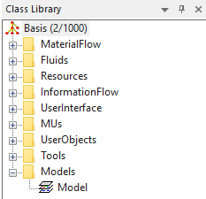
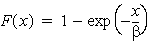
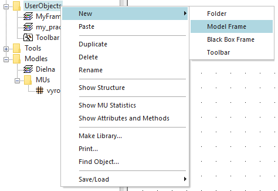

Zoznam obrázkov:

[Obr. 1.1 Hlavné okno programu Plant simulation	5](#_Toc36662152)

[Obr. 1.2 Štruktúra príkazov v menu položky File	6](#_Toc36662153)

[Obr. 1.3 Zobrazenie Ribbon Bar	7](#_Toc36662154)

[Obr. 1.4 Zobrazenie Class Library	8](#_Toc36662155)

[Obr. 1.5 Zobrazenie a skrývanie okien Class Library, Faworites Toolbox a Console	10](#_Toc36662156)

[Obr. 1.6 Vkladanie objektov Station do simulačného modelu	11](#_Toc36662157)

[Obr. 1.7 Prepojenie obkeltov typu Material Flow pomocou objektov typu Connector	11](#_Toc36662158)

[Obr. 1.8 Vytváranie objektov materiálového toku MUs	12](#_Toc36662159)

[Obr. 1.9 Dialógové okná nastavenia objektu Station	13](#_Toc36662160)

[Obr. 2.1Základný simulačný model	14](#_Toc36662161)

[Obr. 2.2 Nastavovacie okno objektu EventController	14](#_Toc36662162)

[Obr. 2.3 Ukážka behu základného simulačného modelu	15](#_Toc36662163)

[Obr. 2.4 Zmena stavov ukazovateľov objektov	15](#_Toc36662164)

[Obr. 2.5 Zmena vlastnosti Name objektu Station	17](#_Toc36662165)

[Obr. 2.6 Princíp zadávania veličín času	18](#_Toc36662166)

[Obr. 3.1 Priebeh simulácie na modely s použitými dopravníkmi	19](#_Toc36662167)

[Obr. 3.2 Dialogové okno nastavovania objektu Source	20](#_Toc36662168)

[Obr. 3.3 Výber generovaných mobilných objektov MUs	21](#_Toc36662169)

[Obr. 3.4 Výber generovaných mobilných objektov MUs pomocou myši	21](#_Toc36662170)

[Obr. 3.5 Ukážka zobrazenia informácií o objekte pomocou balónového okna	21](#_Toc36662171)

[Obr. 3.6 Graf exponenciálnej distribúcie generovania objektov MUs	23](#_Toc36662172)

[Obr. 3.7 Chybové hlásenie objektu	23](#_Toc36662173)

[Obr. 3.8 Ukážka práce s objektom Data Table	24](#_Toc36662174)

[Obr. 3.9 Nastavovanie objektu Data Table pre generovanie objektov MUs	24](#_Toc36662175)

[Obr. 3.10 Zmena farby vektorovej grafiky objektov MUs	25](#_Toc36662176)

[Obr. 3.11 Nastavenie náhodného generovania objektov MUs	26](#_Toc36662177)

[Obr. 3.12 Zobrazenie karty Statistic objektu Source	27](#_Toc36662178)

[Obr. 3.13 Ukážka tabulky záznamu generovaných objektov MUs	28](#_Toc36662179)

[Obr. 3.14 Formát tabuľky DeliveryTable	29](#_Toc36662180)

[Obr. 3.15 Vzhľad simulačného modelu výroby autosedačiek	30](#_Toc36662181)

[Obr. 3.16 Nastavenie karty Attributes objektu Source	30](#_Toc36662182)

[Obr. 3.17 Nastavenie dopravníkov objekty Conveyor	31](#_Toc36662183)

[Obr. 3.18 Nastavenie zásobníka objekt Buffer	31](#_Toc36662184)

[Obr. 3.19 Nastavenie časovej distribúcie objektu Station	32](#_Toc36662185)

[Obr. 3.20 Nastavenie objektu EventController	32](#_Toc36662186)

[Obr. 3.21 Zobrazenie štatistických údajov objektu Station	33](#_Toc36662187)

[Obr. 3.22 Zobrazenie štatistiky mobilných objektov Seat	35](#_Toc36662188)

[Obr. 3.23 Využitie viacerých objektov Source na generovanie MUs	36](#_Toc36662189)

[Obr. 3.24 Ukážka použitia a nastavenie objektu ParallelStation	37](#_Toc36662190)

[Obr. 3.25 Porovnanie použitia objektu ParallelStation a objektov Station	38](#_Toc36662191)

[Obr. 3.26 Ukážka rovnomerného využitia objektov Station	38](#_Toc36662192)

[Obr. 3.27 Ukážka možností nastavenia karty Exit(Exit Strategy)	39](#_Toc36662193)

[Obr. 3.28 Ukážka využiteľnosti staníc v súvislosti s nastavením Exit Strategy	39](#_Toc36662194)

[Obr. 3.29 Ukážka nastavenie Entry Strategy objektu FlowControl	40](#_Toc36662195)

[Obr. 4.1 Ukážka štatistických údajov na karte Type Statistic objektu Drain	41](#_Toc36662196)

[Obr. 4.2 Zobrazenie oddelených štatistických údajov o mobilných objektoch	41](#_Toc36662197)

[Obr. 4.3 Princíp vkladania a nastavenie objektu Chart	42](#_Toc36662198)

[Obr. 4.4 Ukážka nastavovacích možností grafov	43](#_Toc36662199)

[Obr. 4.5 Zobrazenie tabuľky dát ktoré sa vyhodnocujú pomocou objektu Chart	43](#_Toc36662200)

[Obr. 4.6 Zobrazenie dát vo forme tabuľky aj grafu	44](#_Toc36662201)

[Obr. 4.7 Zobrazenie histogramu	44](#_Toc36662202)

[Obr. 4.8 Nastavenie zobrazovacích súradníc grafu	45](#_Toc36662203)

[Obr. 4.9 Zobrazenie časových údajov v grafe	46](#_Toc36662204)

[Obr. 4.10 Zobrazenie možností objektu Display Panel	46](#_Toc36662205)

[Obr. 4.11 Nastavenie objektu Display Panel pre zobrazovanie textových informácií	47](#_Toc36662206)

[Obr. 4.12 Ukážka pridávania textového elementu do objektu Display Panel	47](#_Toc36662207)

[Obr. 4.13 Príklad nastavenia objektu Display Panel so zobrazeným výsledkom	48](#_Toc36662208)

[Obr. 4.14 Zobrazenie objektov Display Panel pre všetky pracovné stanice	48](#_Toc36662209)

[Obr. 4.15 Ukážka zobrazenia objektu Display Panel ako Bars	49](#_Toc36662210)

[Obr. 4.16 Ukážka zobrazenia objektu Display Panel ako LED	49](#_Toc36662211)

[Obr. 5.1 Hierarchické zobrazenie adresára Materila Flow v Class Library	50](#_Toc36662212)

[Obr. 5.2 Príklad simulačného modelu bez využitia hierarchie	51](#_Toc36662213)

[Obr. 5.3 Ukážka vytvárania nového objektu Frame	52](#_Toc36662214)

[Obr. 5.4 Ukážka vytvoreného pod-obiektu SubFrame	52](#_Toc36662215)

[Obr. 5.5 Porovnanie vzhľadu simulačného modelu bez hierarchie a s využitím hierarchie	53](#_Toc36662216)

[Obr. 5.6 Zobrazenie kariet SubFrame	53](#_Toc36662217)

[Obr. 5.7 Zmena objektu SubFrame po pripojení objektov Connector	53](#_Toc36662218)

[Obr. 6.1 Ukážka grafickej zmeny MU	54](#_Toc36662219)

[Obr. 6.2 Vzhľad a ovládania editora ikon	55](#_Toc36662220)

[Obr. 6.3 Príklad vzhľadu vlastnej bitmapy objektu MU.	56](#_Toc36662221)

[Obr. 6.4 Príklad importu grafického súboru do editora ikon	56](#_Toc36662222)

[Obr. 6.5 Ukážka rekalkulácie referenčného bodu ikony	57](#_Toc36662223)

[Obr. 6.6 Ukážka objektu SubFrame s vlastnou grafikou	57](#_Toc36662224)

[Obr. 6.7 Ukážka tvorby animačných bodov ikony objektu SubFrame	58](#_Toc36662225)

[Obr. 6.8 Poloha funkcionality Link v editore ikon	58](#_Toc36662226)

[Obr. 6.9 Ukážka prelinkovania ikony s objektom	59](#_Toc36662227)

[Obr. 6.10 Ukážka simulačného modlu s animáciou ikony objektu SubFrame	59](#_Toc36662228)

[Obr. 6.11 Ukážka prelinkovania objektu Buffer	60](#_Toc36662229)

[Obr. 6.12 Výsledný simulačný model dielne s vlastnou animáciou	60](#_Toc36662230)

[Obr. 6.13 Ukážka použitia vektorovej grafiky	61](#_Toc36662231)

[Obr. 7.1 Ukážka využitia objektu AssemblyStation v montážnom simulačnom modely	62](#_Toc36662232)

[Obr. 7.2 Nastavenie objektu AssemblyStation na základe Predecessorov	63](#_Toc36662233)

[Obr. 7.3 Ukážka nastavenia tabuľky Predecessors	63](#_Toc36662234)

[Obr. 7.4 Výsledný montážny simulačný model s využitím objektu AssemblyStation	64](#_Toc36662235)

[Obr. 7.5 Využitie MU objektu Container v montážnom simulačnom modeli	65](#_Toc36662236)

[Obr. 7.6 Ukážka nastavenia objektu AssemblyStation	65](#_Toc36662237)

[Obr. 7.7 Výsledný montážny simulačný model s využitím MU objektu Container	66](#_Toc36662238)

[Obr. 7.8 Ukážka využitia objektu DismantleStation v simulačnom modeli	66](#_Toc36662239)

[Obr. 8.1 Ukážka dopravníku pre prepravu MUs typu Container	67](#_Toc36662240)

[Obr. 8.2 Postup vloženia objektu TransferStation v aplikácii Plant Simulation	68](#_Toc36662241)

[Obr. 8.3 Ukážka nastavovacích možností objektu TransferStation	69](#_Toc36662242)

[Obr. 8.4 Zadávanie pozície senzora pre objekt TransferStation	69](#_Toc36662243)

[Obr. 8.5 Ukážka práce objektu TransferStation pri nakladaní objektov MU Container na dopravník	70](#_Toc36662244)

[Obr. 8.6  Ukážka práce objektu TransferStation pri vykladaní objektov MU Container z dopravníka	70](#_Toc36662245)

[Obr. 8.7 Ukážka použitia objektu Track v simulačnom modely	71](#_Toc36662246)

[Obr. 8.8 Výsledný simulačný model s využitím viacero typov objektov MUs a prepravy pomocou objektov Conveyor a Track	71](#_Toc36662247)

[Obr. 9.1 Základný simlačný model pre ukážku využitia funkcie služieb	72](#_Toc36662248)

[Obr. 9.2 Zobrazenie objektu Broker a Exporter v simulačnom modeli	73](#_Toc36662249)

[Obr. 9.3 Ukážka nastavenia tabuľky Services objektu Exporter	73](#_Toc36662250)

[Obr. 9.4 Ukážka nastavenia karty Importer objektu stroj_1	74](#_Toc36662251)

[Obr. 9.5 Zobrazenie hierarchickej štruktúry adresára Resources v Class Library	75](#_Toc36662252)

[Obr. 9.6 Ukážka základného simulačného modelu s využitím pracovníkov	76](#_Toc36662253)

[Obr. 9.7 Ukážka nastavenia objektu WorkerPool	76](#_Toc36662254)

[Obr. 9.8 Ukážka simulačného modelu s využitím pracovníka pre model pracoviska stroj_1	77](#_Toc36662255)

[Obr. 9.9 Ukážka simulačného modelu pre všetky pracoviská (stroj_1, stroj_2)	77](#_Toc36662256)

[Obr. 9.10 Ukážka nastavenia práce na zmeny objektu ShiftCalendar	78](#_Toc36662257)

[Obr. 9.11 Ukážka nastavenia objektu WorkerPool pre prácu na zmeny	78](#_Toc36662258)

[Obr. 9.12 Ukážka základného simulačného modelu pre ukážku prenášania MU pomocou pracovníkov	79](#_Toc36662259)

[Obr. 9.13 Ukážka nastavenia objektov WorkerPool	79](#_Toc36662260)

[Obr. 9.14 Ukážka nastavenia karty Importer objektu pracovisko1	80](#_Toc36662261)

[Obr. 9.15 Ukážka výsledného simulačného modelu prenosu MU pomocou pracovníkov	80](#_Toc36662262)

[Obr. 9.16 Ukážka nastavenia Creation Table objektu WorkerPool	81](#_Toc36662263)

[Obr. 9.17 Ukážka nastavenia objektu Worker pre prenos dvoch MUs	81](#_Toc36662264)

[Obr. 9.18 Ukážka nastavenia editora ikon objektu Worker	82](#_Toc36662265)

1. # **Hlavné okno softvéru Plant Simulation**
Aplikácia Tecnomatic Plant Simulations sa spúšťa poklepaním na ikonu  v ponuke štart alebo na ploche systému Windows. Otvorí sa hlavné okno aplikácie. V tomto štádiu nie je aktívny žiadny projekt, ale je možné vybrať základné informácie o používaní aplikácie, ktoré sú rozdelené do troch skupín: Models, Getting started a Web. Projekt sa otvára poklepaním na položku v menu File-New, po ktorej je na výber vytvárať projekt v 2D alebo 3D. Na začiatok je vhodné začať s projektom v 2D, pričom v priebehu tvorby projektu je kedykoľvek možné rozšíriť projekt o možnosť 3D. Hlavné okno softvéru s prázdnym 2D projektom zobrazuje obrázok 1.1.

*Obr. 1.1 Hlavné okno programu Plant simulation*

Hlavné okno aplikácie je rozdelené do štyroch základných oblastí:

- Ribbon Bar 
- Class Library
- Toolbox
- Okno Model
- Ribbon Bar

1. ## **Ribbon Bar**
*Ribbon Bar* je pozdĺž vrchnej časti hlavného programového okna. Ribbon Bar poskytuje základné príkazy a funkcie na prácu so softvérom. Ribbon Bar je rozdelený na jednotlivé karty, pričom každá karta obsahuje príbuznú sadu funkcionalít aplikácie. Základnou položkou Riboon Bar je File. Položka menu File slúži na základnú prácu so softvérom. Ukončenie práce na projekte, ukladanie projektu na disk, otvorenie nového projektu, nastavenie vlastností aplikácie, odkaz na nápovedu, ukončenie práce s aplikáciou atď. Položka menu file obsahuje štandardnú sadu funkcionalít, akú poskytuje väčšina aplikácii Windows. Štruktúru príkazov v menu položky file ukazuje obrázok:

` `**

*Obr. 1.2 Štruktúra príkazov v menu položky File*

Pri práci na projekte je možné Ribbon Bar skryť a tým využívať väčšiu plochu okna modelu na prácu na projekte. Tlačidlo zobrazovania a skrývania Ribbon Bar s príkladmi zobrazenia ukazuje obrázok:

*Obr. 1.3 Zobrazenie Ribbon Bar*
1. ## **Class Library**
Plant simulation aplikácia poskytuje sadu základných objektov. Tieto základné objekty obsahujú základné vlastnosti ktoré umožňujú ich priame použitie v simulačnom modely. Avšak v reálnom svete je tak veľké množstvo konštalácií a objektov ktoré používajú rôzne množstvo vlastností a údajov,  že je nereálne ich obsiahnuť v jednom inštalačnom balíčku. To je dôvod prečo Plant simulation poskytuje základné objekty, ktoré je možné modifikovať akýmkoľvek spôsobom a tým vytvárať objekt požadovaných potrieb. Tieto objekty sa nazývajú *application ohjects*.  

Základné objekty poskytované Softvérom Plant simulation sú klasifikované do skupín na základe kritérií. Poznaním štruktúry objektov a ich kritérií je možné nájsť objekt ktorý má vlastnosti reálneho objektu, ktorý chceme použiť, alebo je možné vytvoriť objekt vlastný modifikovaním a kombináciou základného objektu Plant simulation. Základné objekty softvéru sa nachádzajú v *Class Library*. Základné zabudované objekty softvéru Plant simulation sú hierarchicky usporiadané použitím adresárovej štruktúry s podadresármi. S adresarovou štruktúrov Class Library sa dá pracovať formou pridávania premenovania a mazania adresárov. V základe Plant Simulation Class Library obsahuje deväť adresárov ako ukazuje obrázok:

*Obr. 1.4 Zobrazenie Class Library*

MaterialFlow: sú objekty ktoré slúžia na prácu s objektmi Mobile Units (MU). MaterialFlow objekty umožňujú transport, ukladanie, a zmenu objektov MU. Ide o základné objekty Plant simulation ktoré slúžia na transport a spracovanie materiálu MU naprieč simulačným modelom.  

Fluids: sú objekty na simuláciu transportu volne prúdiacich materiálov ako kvapaliny a plyny. Medzi objekty fluids paria: trubky”Pipes”, zásobník“Tank”, zmiešavač“Mixer” atď.

Resources: tieto objekty umožňujú do simulácie vkladať pracovníkov, a simulovať ich činnosť. Pracovníci môžu poskytovať prácu na pracovných staniciach ako aj zabezpečovať prepravu a prenášania MU. 

InformationFlow: tieto objekty zabezpečujú výmenu informácií medzi objektmi simulačného modelu. Jedná sa napr. o premenné, tabuľky prípadne súbory.

UserInterface: Objekty uľahčujú interakciu medzi užívateľom softvéru, a simulačným modelom. Slúžia na zadávanie a zobrazovanie informácií o modely a výsledky simulácie. Npr. grafy, reporty atď.   

MUs: (Moving Units) reprezentujú materiálový tok. Význam týchto objektov je, že MU sa presúvajú naprieč simulačným modelom. Medzi tieto objekty patrí: Časť”Part”, kontajner”Container” a transporter”Transporter”. 

UserObjects: Nakoľko sa ne odporučuje meniť vlastnosti základných objektov Plant simulation, je zaužívané vytvárať kópie základných objektov a vkladať ich do adresára UserObject: V tomto adresári je možné meniť základné objekty podľa potrieb užívateľa tak aby bola zachovaná základná funkcionalita základných objektov.

Tools: je adresár na ukladanie špeciálnych funkcionalít modelu (add-ins), ktoré spracovávajú určité čiastkové špeciálne úlohy simulácie.

Models: Je pracovný adresár užívateľa softvéru na tvorbu simulačného modelu. Spravidla v tomto adresári užívateľ vytvára model na čo využíva hierarchickú štruktúru(podadresáre). 
1. ## **Toolbox**
Pre rýchlejší prístup k objektom je možné použiť Toolbox. Toolbox je rozdelený do kariet, ktoré obsahujú skupinu príbuzných objektov.(napr. Material Flow, Resources, ...atď). Toolbox sa nachádza pod Ribbon Bar-om. Záleží na užívatelských preferenciách používateľa softvéru, či bude používať Toolbox, alebo Class Library. Vo všeobecnosti je práca s využitím Toolbox rýchlejšia.
1. ## **Práca s Class Library a Toolbox.**
Tak ako okno Ribbon Bar aj okno Class library a Toolbox je možné zobrazovať a skrývať z dôvodu zväčšenia plochy okna hlavného Modelu. Funkciu pre zobrazenie a skrývanie jednotlivých okien, včetne Class Library a Toolbox je možné nájsť na položke Window ktorá sa nachádza na Ribbon Bar-e. Obrázok znázorňuje možnosti položky Window s príkladom zobrazeného a skryteho Toolbox-u.

*Obr. 1.5 Zobrazenie a skrývanie okien Class Library, Faworites Toolbox a Console*
1. ## **Vkladanie modelov do simulačného modelu**
Tak ako bolo spomenuté vyššie je možné použiť niekoľko spôsobov na vkladanie objektov do simulačného modelu. Efektívnou a rýchlou metódou je použiť Toolbox. Najprv je potrebné označiť objekt na Toolbox-e, následne kliknutím lavým tlačídlom myši je tento objekt vložený do modelu čo sa prejaví jeho zobrazením na okne Model. V prípade opakovaného vkladanie jedného typu objektu je možné s ľavým tlačidlom myši použiť kláves Ctrl. Týmto spôsobom je možné kopírovať do hlavného modelu okna viac objektov rovnakého typu ako ukazuje obrázok (vloženie štyroch objektov Station).

*Obr. 1.6 Vkladanie objektov Station do simulačného modelu*

Objekty určené na prenos materiálu (Connector, Conveyor, Track, stď.. )sa vkladajú takým spôsobom, že po výbere objektu na Toolbar-e je potrebné ukázať na vstup alebo výstup objektu uloženého na okne objektu a kliknutím ľavého tlačídla myši vytvoriť prepojenie. V prípade zložitejších objektov slúžiacich na transport Material Flow sa používa dialog na vkladanie objektu. Príklad vloženia objektov Connector prepájajúcich objekty Station a dialógové okno objektu Conveyor znázorňuje obrázok.

*Obr. 1.7 Prepojenie obkeltov typu Material Flow pomocou objektov typu Connector*

V prípade že užívateľ vklada objekty pomocu Class library, vykonáva to spôsobom presúvania objektov pomocou myši držaním ľavého tlačídla myši obdobne ako pri presúvaní súborov medzi oknami v systéme Windows.

V prípade že užívateľ využíva základné objekty softvéru Plant simulation na to aby mohol ich vlastnosti upravovať tak aby pôvodné objekty ostali nezmenené, je potrebné vytvoriť kópie. Štandardne sa táto situácia využíva v prípade objektov Mobile Units (MU) nasledovne:

vytvorenie nového vlastného podadresára MUs v adresári Models, kliknutím pravým tlačidlom myši na Modles a vybratím funkcie New-Folder

prekopírovanie niekoľkých objektov Part do nového podadresára MUs držaním ľavého tlačidla myši spoločne s klávesou Ctrl,

premenovaním zkopirovaných MU podľa vlastných potrieb. **!!!nepoužívať pri menách objektov ani celkovo diakritiku a ani medzery!!!** 

Postup vytvárania nových objektov typu Part v novom adresári MUs znázorňuje obrázok

*Obr. 1.8 Vytváranie objektov materiálového toku MUs*
1. ## **Vlastnosti objektov a ich zmena**
Objekt akéhokoľvek typu obsahuje vlastnosti, ktoré je možné meniť čím sa nastavuje celkový simulačný model. Vzhľadom na zložitosť objektu, niektoré majú viac vlastností, niektoré jednoduchšie(napr. Connector) majú vlastností menej. Pre nastavenie vlastností objektu sa otvára samostatné dialógové okno. Dialogové okno vlastností objektu sa otvára dvojklikom ľavým tlačídlom miši na objekt alebo kliknutím pravého tlačidly myši na objekt s výberom Open. Príklad dialógových okien objektov Station, Connector a Part ukazuje obrázok spolu s ukážkou výberu Open.

*Obr. 1.9 Dialógové okná nastavenia objektu Station*

Skupiny objektov rovnakého typu(napr. objekty Material Flow) majú niektoré vlastnosti spoločné. Funkcionalita jednotlivých objektov, ich možnosti a nastavenia budú postupne vysvetlované na príkladoch.
1. # **Vytvorenie základného simulačného modelu**
Na hlavné okno model presuňme objekt Source, Station a Drain. Tieto objekty prepojíme konektorom. Výsledný jednoduchý model ukazuje obrázok.

*Obr. 2.1Základný simulačný model*

Beh simulačného modelu ovláda objekt EventController. Tento objekt sa implicitne nachádza po vytvorení nového projektu na hlavnom okne model. Pokiaľ sa objekt EventControler na hlavnom okne nenachádza je možné ho doplniť za pomoci ToolBox panelu z karty Material Flow.  Po otvorení vlastností objektu EventControler(napr. dvojklikom) sa otvorí nastavovacie dialogove okno EventContorler obr.

*Obr. 2.2 Nastavovacie okno objektu EventController*

Simuláciu je možné spustiť pomocou tlačidla Štart/Stop simulácia. Beh simulácie sa prejaví narastajúcim časom v informačnom okne Time a preblikávaním status lediek na simulačnom modeli ako ukazuje obr.

*Obr. 2.3 Ukážka behu základného simulačného modelu*

Zároveň sa na jednotlivých objektoch zobrazujú objekty MUs, čo sú v našom jednoduchom prípade objekty typu Part. Posúvaním nastavenia rýchlosti simulácie sa koriguje rýchlosť simulácie čo sa prejaví rýchlosťou ubiehajúceho času a zobrazovaním MUs objektov. Simuláciu je možné zastaviť opätovným stlačením tlačidla Štart/Stop. Reset simulácie je možné vykonať poklepaním na tlačidlo reset. Resetuje sa objekt EventControler, vynuluje sa odpočítavanie času vynuluje sa používané MUs a je možné simuláciu opätovne spustiť od východzieho stavu. V prípade, že chceme využiť funkcionalitu rýchle dopredu, a prejsť celou simuláciou v najkratšom možnom čase, je potrebné nastaviť dĺžku celkovej simulácie. Toto sa vykonáva na karte Settings objektu EventControler na položke End.
1. ## **Význam ukazovateľov stavu objektu.**
Objekty simulačného modelu sa môžu nachádzať v určitom prevádzkovom stave. Napr. objekt materiálového toku  Station sa môže nachádzať v stave, že pracuje, čaká , je blokovaný atď. Stav týchto objektov je možné ukazovať pomocou zmeny ikony alebo pomocou farebných ukazovateľov ktoré sa zobrazujú pri ikone daného objektu. Zobrazovanie stavov pomocou ukazovateľov a zobrazovanie materiálového toku je možné zapnúť alebo vypnúť na Ribon bare na paneli Home v časti Animations tlačidlami MUs a Icons, ako ukazuje obrázok.

*Obr. 2.4 Zmena stavov ukazovateľov objektov*

Základný význam jednotlivých stavov objektov sumarizuje tabuľka:

|Stav objektu|Ukážka|Farba Indikátora|
| - | - | - |
|Blokované||źltá|
|Závada||červená|
|Pauza||modrá|
|Zapínanie/Vypínanie||fialová|
|Reštartovanie||tyrkysová|
|Nastavovanie||hnedá|
|Zastavovanie||ružová|
|Neplánované||slabo modrá|
|Čakanie ||oranžová|
|Práca||zelená|

V prípade nášho jednoduchého modelu je možné vidieť len stav Práca (zelený indikátor) kedy stanica vykonáva činnosť a stav Blokovanie (žltý indikátor) kedy objekt Source čaká na to kým stanica vykoná prácu a uvoľni  miesto pre ďalšie MU ktoré sa bude spracovávať.
1. ## **Nastavenie vlastností objektov materiálového toku**
Vlastnosti objektov simulačného modelu je možné meniť a nastavovať tak aby celkový model nadobúdal vlastnosti s realitou, a aby mohlo byť skúmané jeho správanie. Dialog nastavenia vlastností objektov sa otvára dvojklikom ľavým tlačidlom myši na objekt, alebo pravým tlačidlom myši z výberom možnosti Open v menu. Každý objekt obsahuje vlastnosti a nastavenia v závislosti od toho o aký objekt sa jedná a na čo sa používa. V prípade že potrebujeme objekt so špecifickou úlohou ktorá nie-je zahrnutá v základných objektoch, je možné vytvoriť si objekt vlastný.   
1. ## **Zmena základných vlastností objektu Station**
Dvojklikom na objekt station v základnom simulačnom modeli sa otvorí dialógové okno nastavenia tohto objektu. Základná vlastnosť ktorú je možné meniť je meno (Name) objektu. V prípade zmeny vlastnosti Name objektu platí zásada:

**!!!nepoužívať pri menách objektov ani celkovo diakritiku a ani medzery!!!** 

Vlastnosť objektu Name je špecifická pre daný objekt, nemôže byť v projekte viac objektov z rovnakým menom, a využíva sa na volanie objektu z ktorejkoľvek časti projektu. Zmeňme vlastnosť Name objektu Station na stroj tak ako ukazuje obrázok:

*Obr. 2.5 Zmena vlastnosti Name objektu Station*

Zmena názvu sa prejavila v popise objektu na hlavnom okne. Vedľa každej vlastnosti ktorú je možné nastavovať sa štandardne nachádza zeleno-modrý štvorček. Tento znázorňuje že vlastnosť je zatiaľ nezmenená, jej hodnota je zdedená z predchodcu. Pokiaľ vlastnost zmeníme štvorček zmení farbu . Táto zmena indikuje zmenu implicitne nastavených vlastností objektu. Zmeny sa aplikujú až po poklepaní na tlačidlo Apply . Poklepaním na tento štvorček po zmene vlastností je možné nastaviť danú vlastnosť do pôvodného stavu(zdediť vlastnosť po rodičovi). 

Vlastnosti objektu sú usporiadané do skupín ktoré sa nachádzajú na kartách dialógového okna. V prípade objektu Station sa jedná o karty: “Times”, ”Set-Up”, ”Failures”, ”Controls”, ”Exit”, “Statistic”, “Importer”, “Energy”, “Cost” a “User-defined”. V prípade že chceme zmeniť dĺžku času práce stanice s aktuálnym MU, je možné toto nastaviť na karte Time zmenou položky Processing Time. Implicitne je táto položka nastavené na 10s. Zmeňme toto nastavenie na 1min 20s zadaním 1:20 a kliknutím na tlačidlo  ako ukazuje obr.

*Obr. 2.6 Princíp zadávania veličín času*

Aj v prípade zmeny vlastnosti času, zmení sa aj indikátor dedičnosti zna. Nad oknom zadávania času je zobrazená nápoveda ktorá ukazuje formát zadávania času “DDD:HH:MM:SS.XXXX”. To znamená, že Dni-DDD, hodiny-HH, minúty-MM a sekundy-SS sú oddelené znakom dvojbodka ”:”. Ak je potrebné tak je možné zadávať aj desatiny, prípadne stotiny sekundy za znakom bodka”.” ktorý reprezentuje desatinnú čiarku. V prípade že zadáme údaj len v skundách “napr. 3860” po kliknutí na tlačidlo Apply sa automaticky tento údaj pretransformuj na 1 hod. 4 min. a 20 sekúnd “1:04:20”.
1. # **Presúvanie MUs**
V prípade jednoduchého modelu s predchádzajúceho príkladu bol použitý objekt Connector na presun MUs medzi objektami Source Station “ktorá bola následne premenovaná na stroj” a Drain. Znamená to, že akonáhle bolo vygenerované MU pomocou Source okamžite bolo odovzdané na stroj, a akonáhle stroj ukončil činnosť s týmto MU, okamžite ho odovzdal na objekt Drain, kde materiálový tok MUs modelu končí. V praxi takáto situácia zvyčajne nie-je. Obyčajne sú objekty materiálového toku premiestňované pomocou dopravníkov, vozíkov, žeriavov, prípadne iných zariadení určených na prepravu materiálu. SW plant simulation štandardne používa objekt Conveyor na presúvanie objektov MUs. Objekt Conveyor reprezentuje dopravník. Objekt Conveyor môže byť priamy, môže obsahovať oblúky, je možné nastaviť jeho rozmery, rýchlosť posúvania MUs atď. Objekt Conveyor je možné nájsť na Toolboxe, karte Material Flow, jeho ikona je .

Pôvodný simulačný model rozšírime o objekt Conveyor pred aj za stanicou stroj tým spôsobom že pôvodné objekty Connector vymažeme a nahradíme objektami Conveyor  na ktoré následne pospajame objektami Connector. Výsledný upravený simulačný model so spustenou simuláciou znázorňuje obrázok. 

*Obr. 3.1 Priebeh simulácie na modely s použitými dopravníkmi*

`  `Na tomto obrázku je vidieť objekty MUs ako sa posúvajú po dopravníkoch určitou rýchlosťou podľa toho v akých časových intervaloch sú generované ako rýchlo sú spracovávané stanicou stroj. Je možné nastaviť rýchlosť simulácie pomocou slidera objektu EventControler. Pokiaľ nastavíme rovnaký čas generovania objektov nastavim Source na 1min. a taktiež čas spracovania na stanici stroj na 1min., simulačný model pracuje stabilne bez toho aby sa dopravníky zapĺňali, a bez toho aby objekt generovania MUs Source bol blokovaný  a čakal kým sa uvoľní dopravník Conveyor.
1. ## **Generovanie “objektov MUs” pomocou objektu Source**
Na generovanie objektov MUs sa používa objekt Source. Z objektu Source objekty MUs vstupujú do simulačného modelu, prechádzajú ním na zaklade nastavenie modelu pomocou objektov Material Flow a potom sa strácajú v objektoch Drain. Na pôvodnom jednoduchom modly ukážem základné možnosti generovania MUs tak aby sa model zhodoval s prípadmi, ktoré môžu reálne nastať.

Základné nastavenie objektu Source sa nachádza na karte Attributes, jej možnosti a vzhľad ukazuje obrázok.

*Obr. 3.2 Dialogové okno nastavovania objektu Source*

Z obrázku je zrejme “na základe okienka dedičnosti”, že jediná vlastnosť ktorá je zmenená je interval generovania na 1min. Základom nastavenia je informácia aké MU chceme generovať. Toto nastavenie je v dolnej časti karty Attributes . Je niekoľko možností ako nastaviť túto položku. Jednou z možností je kliknutím na … a výberom Select Object otvoriť dialógové okno výberu MUs ako ukazuje obrázok:

*Obr. 3.3 Výber generovaných mobilných objektov MUs*

V spodnej časti sa nachádza informácia v akom adresáre sa aktuálne nachádzame. V tomto adresári sa nachádzajú objekty “Container, Part, Transporter”. O úroveň vyššie v adresárovej štruktúre objektu sa dostaneme poklepaním na tlačidlo . Týmto spôsobom môžeme prechádzať adresárovú štruktúru projektu. Preskúmaním Class Library vieme, že objekty MUs ktoré chceme používať v projekte simulačnéhom modelu sa nachádzajú : Models/MUs. Jedná sa o objekty “diel\_A, diel\_B, diel\_C”. Prejdeme do adresára a vyberieme objekt “diel\_A”. Výber sa prejaví nasledovne: . 

Ďalšia možnosť výberu MU je pretiahnutím pomocou myši so stlačeným ľavým tlačidlom priamo z Class Library a pustením v časti kde má byť informácia o MU. Princíp zadávania znázorňuje obr.

*Obr. 3.4 Výber generovaných mobilných objektov MUs pomocou myši*

Po tejto zmene po spustení simulácie, následným zastavením a podržaním kurzora myši nad daným objektom MU je vidieť balónové okno informácií o danom objekte ako ukazuje obr.

*Obr. 3.5 Ukážka zobrazenia informácií o objekte pomocou balónového okna*

Z aktuálnej balónovej informácie je zrejmé že sa jedná o objekt diel\_A, je to tretí kus v poradí a nachádza sa na objekte Conveyor. 
1. ## **Generovanie objektov MU v zadanom intervale.**
MU je možné generovať v danom intervale dookola výberom položky Time of creation Interval Adjustable. Pokiaľ je potrebné generovať nekonečné množstvo stále dookola je potrebné v poli Amount (množstvo) ponechať hodnotu -1. -1 pre SW Plant simulation znamená nekonečné množstvo! Pokiaľ potrebné generovať len určité množstvo, je možné toto množstvo zadať do položky Amount. 

Interval generovania sa zadáva v poli Interval. Prvou položkou je funkcia pravdepodobnosti distribúcie. Základ systému tvorí niekoľko funkcií pravdepodobnosti ktoré je možné použiť. Samozrejme je možné vytvoriť si distribučné funkcie vlastné, prípadne využívať konkrétny zoznam vytvorený napríklad zo záznamu reálneho systému. V prípade využívania základných funkcií pravdepodobnosti distribúcie nachádzajúcich sa v systéme je potrebné na ich implementáciu využívať help SW Plant Simulation. Vysvetlím distribúciu negatívne exponenciálnu, ktorú je možné vybrať ako Negexp. 

Negatívne exponenciálna distribúcia je kontinuálna distribúcia. Volá sa negatívna, pretože je negatívne znamienko v exponente. Pre realizáciu sa využíva kladná časť funkcie. Funkcia má nasledovný tvar:

Parameter beta 𝞫 určuje priemernú hodnotu. Parameter 𝞫 musí byť kladná hodnota a musí byť väčší ako 0. V prípade potreby je možné zadať spodnú a hornú hranicu funkcie distribúcie. Príklad na obrázku znázorňuje negatívne exponenciálnu distribúciu pri použití parametru 𝞫=2.

*Obr. 3.6 Graf exponenciálnej distribúcie generovania objektov MUs*

V prípade metody Interval Adjustable je možné zadať parameter štartu Start a parameter konca Stop.
1. ## **Generovanie viac typov MU pomocou jedneho zdroja Source**
Pokiaľ chceme aby zdroj Source generoval viac typov MUs môžeme na to použiť funkciu Mu selection: kde je možné vybrať Sequence Cyclical. Pokiaľ vyberieme túto možnosť a klikneme na , vypíše sa chybové hlásenie Object is not a table, ako na obrázku.

*Obr. 3.7 Chybové hlásenie objektu*

Výberom možnosti Mu selection Sequence Cyclical je potrebné ak o vstup zadať tabulku Table, ktorú je potrebné vytvoriť. 

Karta Information Flow na paneli Toolbox sa nachádza objekt Data Table  ktorý vložíme do hlavného okna obdobne ako ostatné objekty simulačného modelu. Po vložení na hlavný Frame a kliknutím pravého tlačidla myši je možné Objekt Datatable premenovať podľa vlastných potrieb napr “MyMUsGen”. Dvojklikom na objekt tabuľky sa otvorí tabuľka s riadkami a stĺpcami ako ukazuje obrázok. Medzi kartou Frame a zobrazením tabulky je možné prechádzať prepínaním v spodnej časti okna. 

*Obr. 3.8 Ukážka práce s objektom Data Table*

Vytvorením tabuľky je možné ukladať do tabulky dáta, ktoré budú následne využívané v simulačnom modeli. Otvoríme vlastnosti Source c položke MU selection: vyberieme možnosť Sequence Cyclical a do políčka Table: napíšeme meno vytvorenej tabuľky “MyMUsGen”, alebo tabulku vložíme metofou pretiahnutia myšou so stlačeným lavým tlačidlom. Tabuľka sa teraz používa na generovanie MU, pričom sa automaticky naformátujú stĺpce, a môžu sa do nej vkladať údaje. Do tabuľky vložíme údaje podľa nasledujúceho obrázka:(MU je možné vkladať systémom preťahovania myšou).

*Obr. 3.9 Nastavovanie objektu Data Table pre generovanie objektov MUs*

Príklad funguje nasledovne: V prvej minúte sa vygeneruje diel\_A, v druhej diel\_B, v tretej diel\_B, vo štvrtej diel\_A, ...atď stále dookola. Po spustení simulácie sa zmena neprejaví. Na zrozumiteľné rozpoznanie MUs je vhodné zmeniť ich vzhľad. Výberom MU z Class Library pomocou dvojklikom myši alebo poklepaním pravého tlačidla myši a výberom Open sa zobrazí nastavovacie okno vlastností modelu MU. Výberom karty Graphics sa zobrazia možnosti nastavenia vzhľadu objektu MU. Pokiaľ ponecháme zaškrtnuté políčko Vector graphics active, je možné zmeniť základný farbu Color: objektu MU. Takýmto spôsobom je možné napr. zmeniť diel\_B, aby sa zobrazoval zelenou farbou. Nastavenie zmeny farby MU so spustenou simuláciou generovania viac typov MUs znázorňuje obrázok.

*Obr. 3.10 Zmena farby vektorovej grafiky objektov MUs*

Pokiaľ sa majú MUs vygenerovať len raz, nie cyklicky dookola je možné v nastaveniach objektu source vybrať v časti MU selection: položku Sequence . 
1. ## **Náhodné generovanie objektov MUs.**
Ďalšou možnosťou výberu MU selection, je možnosť random. Pri výbere tejto možnosti sa taktiež vkladá tabuľka, avšak nakoľko táto tabuľka je nositeľom iných údajov je potrebné aby bola preformátovaná. Na preformátovanie tabulky s možnou stratou dát softvér upozorní hlásením. V tabuľke pre výber random sa nachádzajú tieto údaje:

MU: Objekt ktorý sa bude generovať

Frequency: Podiel generovania 

Number: Počet vygenerovaných objektov v danú chvíľu

Name: Názov objektu (nie-je potrebné zadávať) 

Attributes: Atribút objektu (nie-je  potrebné zadáva) 

Príklad nastavenie tabuľky Random z dôsledkom na simuláciu znázorňuje obrázok.

*Obr. 3.11 Nastavenie náhodného generovania objektov MUs*

Nastavenie objektu Source MU selection na Percentage má rovnaký efekt ako Random s tým rozdielom, že hodnota podielu generovania MUs sa nastavuje v percentách.
1. ## **Záznam vygenerovaných MUs do tabuľky.** 
Objekt Source umožňuje zaznamenať čas a typ vygenerovaných objektov MUs počas svojej funkčnosti. Túto funkciu je možné aktivovať na karte Statistics nastavenia objektu Source. Na tejto karte sa nachádza základná štatistika funkčnosti objektu. V spodnej časti je zaškrtávacie políčko Creation Table. Zaškrtnutím tohto políčka sa vytvára tabulka ktorú je potom možné zobraziť poklepaním na tlačidlo Open. Príklad na obrázku znázorňuje kartu Statistics objektu Source. 

*Obr. 3.12 Zobrazenie karty Statistic objektu Source*

Tabulku je možné exportovať, použiť na analýzu, prípadne v inom simulačnom modeli na generovanie MUs. Obrázok znázorňuje vygenerované tabulky, pri dvoch rôznych nastaveniach počas prvých 30 minút simulácie. Generovanie MU je nastavené ako konštanta na jednu minútu. Generujú sa MU diel\_A a MU diel\_B. NaStavenie generovania medzi MU sú náhodné pričom v prvom prípade chceme aby v prípade vľavo bol podiel 2 ku 8, čiže dielov A je podstatne menej. V prípade na obrázku vpravo je pomer dielov nastavený rovnako. 

*Obr. 3.13 Ukážka tabulky záznamu generovaných objektov MUs*

V prípade, že je zvolená možnosť Numer Adjustable, tak sa generuje len daný počet objektov MU naraz. V tomto prípade nemôže byť zadaná voľba Amount: nekonečno, teda -1.

Ďalšou možnosťou je možnosť Time of creation: Delivery Table. Delivery Table umožňuje zadávať presný čas, množstvo a meno MU. Tvar a formás s príkladom, delivery table zobrazuje obrázok.

*Obr. 3.14 Formát tabuľky DeliveryTable*
1. ## **Cvičenie: Pracovná stanica pre montáž autosedačiek:**
Cieľ: Vytvorenie jednoduchého simulačného modelu ktorý na základe zadaných vstupných dát bude simulovať prácu montážneho pracoviska autosedačiek. Vstupné údaje sú nasledovné:

Doba medzi príchodom základovej konštrukcie sa riadi podľa exponenciálneho rozdelenia so strednou hodnotou 10 min,

` `Doba kompletizácie sa riadi podľa normálneho rozdelenie NORM(10,2,5,20) min,

` `Doba na prepravu po prepravníku je 30 sekúnd k pracovnej stanici a 30 sekúnd od pracovnej stanice. 

Cieľ úlohy: zistite

využitie pracovnej stanice,

počet skompletizovaných sedačiek za 960 minút (16 hodín),

ako dlho sa priemerne  zdržala jedna sedačka v systéme.

Tvorba simulačného modelu 

Postup tvorby simulačného modelu je nasledujúci. Najskôr pod zložku Models vytvoríme zložku Manufactory do ktorej vložíme frame, ktorý premenujeme na fin\_1.

Na frame vložíme nasledujúce objekty:

1x-Source

2x-Conveyor

1x-Buffer

1x-Station

1x-Drain

Do zložky Manufactory pridáme zložku MU a do nej prekopírujeme Part ktorý premenujeme na seat. Komponenty prepojíme konektorom podľa nasledovného obrázka.

*Obr. 3.15 Vzhľad simulačného modelu výroby autosedačiek*

Následne je možné nastaviť všetky komponenty modelu podľa požiadaviek. Nastavenie komponenty Source, generovanie príchodu základovej konštrukcie ako Part nazvaného seat v časovom intervale Negexp na 10min  podľa obrázka:

*Obr. 3.16 Nastavenie karty Attributes objektu Source*

Nastavenie oboch dopravníkov Conveyor aj Conveyor1 na 30 sekúnd.

*Obr. 3.17 Nastavenie dopravníkov objekty Conveyor*

Pred stanicou na ktorej sa vykonáva samotná operácia čalúnenia ja vložený zásobník Buffer, na ktorom je nastavená neobmedzená kapacita.

*Obr. 3.18 Nastavenie zásobníka objekt Buffer*

Samotný proces šitia čalúnenia ja na stanici Station , kde je definované chovanie pomocou distribučnej funkcie s normálovým rozdelením. Pretože normálové rozdelenie môže nadobúdať záporné hodnoty, sú nastavené krajné medze generovaných časov. 

*Obr. 3.19 Nastavenie časovej distribúcie objektu Station*

Objekt Drain je ponechaný na defaultných hodnotách. 

Dĺžka simulácie sa nastavuje pomocou komponenty EventController na karte Settings.

*Obr. 3.20 Nastavenie objektu EventController*
1. ## **Výsledky cieľov úlohy**
Pri určovaní výsledkov je potrebné aby prebehla celá simulácia do konca požadovaného času. Simuláciu je možné urýchliť tlačidlom Start Fast Forward Simulation ktorý sa nachádza na karte Home alebo je ho možné nájsť po otvorení vlastností EventController

Využitie pracovnej stanice:

Otvorením vlastností Station a prepnutím na kartu Statistic je možné vidieť množstvo informácií prislúchajúcich objektu Station. Zoznam dát karty Statistics a ich vlastností sumarizuje tabulka.

*Obr. 3.21 Zobrazenie štatistických údajov objektu Station*

|Working:|Štatisticky zobrazuje obdobie počas ktorého stanica pracovala. |
| - | - |
|Setting-up:|Štatisticky zobrazuje obdobie pačas ktorého sa stanica uvádzala do prevádzky.|
|Waiting:|Štatictický zobrazuje obdobie počas ktorého stanica čakala na materiál.|
|BLocked:|Štatisticky zobrazuje obdobie počas ktorého bola stanica blokovaná. |
|Powering up/down:|Štatisticky zobrazuje obdobie potrebné na zapínanie a vypínanie stanice.|
|Failed:|Štatisticky zobrazuje obdobie počas ktorého bola stanica nefunkčná.|
|Stopped:|Štatisticky zobrazuje obdobie počas ktorého bola stanica nefunkčná(npr. z dôvodu nedostatku energií).|
|Paused:|Štatisticky zobrazuje obdobie počas ktorého stanica stála z dôvodu prestávky.|
|Unplanned:|Štatisticky zobrazuje obdobie počas ktorého bola stanica odstavená neplánovane.|
|Reltive occupation|Štatisticky zobrzuje obdobie počas ktorého bol v stanici objekt material flow. |
|Relative empty|Štatisticky zobrazuje obdobie počas ktorého bola stanica k dispozícii ale nepracovala.|
|Contens|Zobrazuje množstvo MUs objektov ktoré stanica obsahuje.|
|Minimum Contens|Zobrazuje minimálne množstvo objektov MUs ktoré stanica obsahovala počas simulácie. |
|Maximum Contens|Zobrazuje maximálne množstvo objektov MUs ktoré stanica obsahovala počas simulácie. |
|Entries|Zobrazuje množstvo objektov MUs, ktoré do stanice vstúpili|
|Exits|Zobrazuje množstvo objektov MUs, ktoré zo stanice vystúpili.|

1. ## **Počet skompletizovaných sedačiek za 960 minút (16 hodín)**
Skompletizované množstvo sedačiek je možné určiť tak, že zistíme počet MU ktoré opustilo systém. MU opúšťajú systém pomocou komponenty Drain. Otvorením vlastností komponenty Drain na karte Statistic je možné nájsť hodnotu Exits, čo reprezentuje počet MU ktoré opustia simulačný model, teda v našom prípade sa jedná o počet skompletizovaných sedačiek. 

Ako dlho sa priemerne  zdržala jedna sedačka v systéme

Základnú štatistiku všetkých vygenerovaných MUs daného typu a mena, je možné znázorniť pomocou karty Product Statistics otvorením Open daného objektu MU ktorý je v adresári MUs Class Library. Štatistiku všetkých objektov seat znázorňuje obr.

*Obr. 3.22 Zobrazenie štatistiky mobilných objektov Seat*

V tomto konkrétnom príklade bolo objektom Drain zmazaných 91 objektov seat, 6 objektov seat sa stále nachádza v simulačnom modeli, čiže celkovo ich bolo vygenerovaných 97. Priemerný čas ktorý strávil objekt seat v simulačnom modely bol (Average lifespan:): 1hod, 4 min a 14,9651 sekúnd. Taktiež je na tejto karte možné zhliadnuť štatistiku (Working, Setting-up, Waiting, Stopped, Failed a Paused) objektov počas práce (Production), presúvaní sa (Transport) a uskladnenia (Storage).
1. ## **Samostatne cvičenie: Pracovná stanica pre montáž autosedačiek dvoch typov:**
Cieľ: Vytvorenie jednoducheho simulačného modelu ktorý na základe zadaných vstupných dát bude simulovať prácu montážneho pracoviska autosedačiek. Vstupné údaje sú nasledovné:

Doba medzi príchodom základovej konštrukcie prvého typu sa riadi podľa exponenciálneho rozdelenia so strednou hodnotou 5 min, druhého typu 11 min,

` `Doba kompletizácie sa riadi podľa normálneho rozdelenie NORM(10,2,5,20) min,

` `Doba na prepravu po prepravníku je 30 sekúnd k pracovnej stanici a 30 sekúnd od pracovnej stanice. 

Cieľ úlohy: zistite

využitie pracovnej stanice,

počet skompletizovaných sedačiek za 960 minút (16 hodín),

ako dlho sa priemerne  zdržala jedna sedačka v systéme.
1. ## **Tvorba simulačného modelu** 
Simulačný model bude obsahovať dva objekty MUs. Každý objekt bude generovaný pomocou jedného zdroja. Ukážku časti simulačného modelu, kde sa generujú objekty MUs znázorňuje obrázok. Z dôvodu prehľadnosti je možné nastaviť rôzne zobrazenie objektov. 

*Obr. 3.23 Využitie viacerých objektov Source na generovanie MUs*
1. ## **Objekt ParallelStation**
Objekt ParallelStation je rozšírenie objektu Station o možnosť simulovať niekoľko objektov Station jedným objektom. Na základnej karte Attributes sa nachádza nastavenie X-dimension a Y-dimension. V prípade že chceme simulovať dve pracovné stanice nastavíme X-dimension na 2 a y Dimension na 1.

Cvičenie: Pracovná stanica pre montáž autosedačiek s dvoma pracoviskami, s monotovaním dvoch typov autosedačiek:

Cieľ: Vytvorenie jednoducheho simulačného modelu ktorý na základe zadaných vstupných dát bude simulovať prácu montážneho pracoviska autosedačiek. Vstupné údaje sú nasledovné:

Doba medzi príchodom základovej konštrukcie prvého typu sa riadi podľa exponenciálneho rozdelenia so strednou hodnotou 5 min, druhého typu 11 min,

` `Doba kompletizácie sa riadi podľa normálneho rozdelenie TRIA(10,8,12) min,

` `Doba na prepravu po prepravníku je 30 sekúnd k pracovnej stanici a 45 sekúnd od pracovnej stanice. 

Cieľ úlohy: zistite

využitie pracovnej stanice,

počet skompletizovaných sedačiek za 960 minút (16 hodín),

ako dlho sa priemerne  zdržala jedna sedačka v systéme.

Tvorba simulačného modelu 

Namiesto objektu Station je v simulačnom modeli použitý model ParallelStation ako ukazuje obr.

*Obr. 3.24 Ukážka použitia a nastavenie objektu ParallelStation*

Samostatné cvičenie: Porovnanie Objektov Station s Objektom ParallelStation.

Vytvorený simulačný model s použitím objektu ParallelStation porovnajte so simulačným modelom vytvoreným pomocou dvoch objektov Station ako ukazuje Obr.

*Obr. 3.25 Porovnanie použitia objektu ParallelStation a objektov Station*

Samostatné cvičenie: Nájdite potrebný počet staníc pre plynulý chod simulácie(zabránenie zapĺňaniu objektu Buffer):
1. ## **Exit strategia a objekt FlowControl**
V prípade, že použijeme nastavenie z predošlého príkladu, pre plynulý beh simulácie bez efektu zapĺňania sa objektu Buffer, potrebujeme štyri objekty station. Ak použijeme graf na znázornenie vyťažiteľnosti staníc vidíme, že každá stanica je vyťažená  niečo málo nad 70%. Ako ukazuje obrázok:

*Obr. 3.26 Ukážka rovnomerného využitia objektov Station*

Z objektu Buffer vystupujú štyri objekty Connector. AKým spôsobom sa prerozdelujú objekty MUs na jednotlivé konektory má zásadný vplyv na priebeh simulácie a výsledok simulačného modelu. Nastavenie prerozdelovania MUs na výstupné konektory sa nachádza na karte Exits daného objektu(v našom prípade objektu Buffer) obrázok:

*Obr. 3.27 Ukážka možností nastavenia karty Exit(Exit Strategy)*

Implicitne je táto hodnota nastavené na Cyclic, to znamená že výstup sa cyklicky prepína v danom poradí. Zmeňme nastavenie objektov station nasledovne: Processing Time: objektu Station\_1 a Station\_2 na Const 1:0. Výsledok na simulačný model a Working Time znázorňuje obrázok.

*Obr. 3.28 Ukážka využiteľnosti staníc v súvislosti s nastavením Exit Strategy*

Nakoľko sa MUs prerozdeluju z objektu buffer cyklicky, musí objekt Station\_1 a Station\_2 čakať na pomalšie pracujúce objekty Station\_3 a Station\_4. V prípade že nastavíme Exit stratégiu objektu na Most Recent Demand (posledný dopyt), situácia sa zmení. Kartu nastavenia Exit obsahujú objekty, kde je možné pripojiť viacej objektov Connector. V prípade že potrebujeme riadiť aj vstupné pravidlá je možné použiť objekt FlowControl , ktorý sa nachádza na karte Material Flow. V prípade objektu FlowControl je možné nastaviť vstupnú (Entry Strategy), ale aj výstupnú (Exit Strategy) stratégiu obr .       

*Obr. 3.29 Ukážka nastavenie Entry Strategy objektu FlowControl*
1. # **Štatistiky a grafy**
Väčšina objektov je schopná zbierať spracovávať a ukazovať základné štatistiky. Tieto štatistiky sa spravidla nachádzajú na karte Statistics daného objektu. Zvláštnosťou je objekt Drain, ktorý naviac obsahuje kartu Type statistics, kde sa nachádzajú ďalšie štatistické údaje obr.

*Obr. 4.1 Ukážka štatistických údajov na karte Type Statistic objektu Drain*

Po stlačení tlačidla Detailed Statistic Table  sa zobrazia kompletné štatistické údaje o každom MU oddelene obr.

*Obr. 4.2 Zobrazenie oddelených štatistických údajov o mobilných objektoch*
1. ## **Grafy**
Za účelom zrozumitelnej ukážky funkčnosti simulačného modelu je možné využívať grafy. Softvér plan simulation v základe umožňuje využívať tri typy grafov. 

Chart

Histogram 

Plotter
1. ## **Využívanie grafov typu Chart.**
Funkciu zobrazenia grafu aktivujeme vložením objektu Chart  z karty User Interface panela Toolbox. Po vložení grafu treba objektu prideliť dáta ktoré chceme zobrazovať. Napríklad zobrazenie štatistických údajov jednotlivých staníc vykonáme tak, že vyberieme stanice a pomocou pretiahnutia myšou s ľavým tlačídlom tieto stanice vložíme na objekt Chart. Princíp ukazuje obrázok.

*Obr. 4.3 Princíp vkladania a nastavenie objektu Chart*  

Následne výberom hodnoty Resource Statistics zobrazíme graf. Graf v stĺpcovom tvare zobrazuje štatistické údaje práce jednotlivých pracovných staníc. Hodnoty v grafe sa zobrazujú len vtedy ak je aktivna simulácia alebo prebehol určitý čas simulácie. Okno zobrazenia grafu je možné vypnúť poklepaním na krížik okna grafu v pravom hornom rohu. Pokiaľ chceme zobrazenie grafu obnoviť je možné na objekt grafu poklepať pravým tlačidlom myši s následným výberom položky Show, a graf sa znovu zobrazí. Nastavenie grafu je možné vyvolať dvojklikom ľavým tlačidlom myši, alebo pravým tlačidlom s výberom hodnoty Open. Dialog nastavovacích možností grafu ukazuje obrázok.

*Obr. 4.4 Ukážka nastavovacích možností grafov*     

Na karte Data je možné nastaviť dáta ktoré sa zobrazujú. Kliknutím na tlačidlo Imput Channels  sa zobrazí tabuľka so vstupnými hodnotami ktoré sa aktuálne zobrazujú. Túto tabuľku je možné upraviť. Tabuľku štatistických hodnôt práce staníc zobrazuje obrázok:

*Obr. 4.5 Zobrazenie tabuľky dát ktoré sa vyhodnocujú pomocou objektu Chart*

Na ďalších kartách je možné nastaviť ďalšie vlastnosti objektu Chart. Napríklad na karte Display je možné zvoliť v položke Graph / table: možnosť zobrazenia údajov aj v podobe tabuľky. Výsledné zobrazenie štatistických údajov jednotlivých staníc vo forme tabulky aj grafu zobrazuje obrázok.

*Obr. 4.6 Zobrazenie dát vo forme tabuľky aj grafu*  
1. ## **Histogram**
Zobrazenie formou histogramu je možné využiť v prípade, keď napríklad potrebujeme informáciu o počte objektov MUs uložených v zásobníku (objekt Buffer), alebo o počte objektov ktoré sa prepravujú pomocou dopravníku (objekt Conveyor). 

Na základne pracovné prostredie vložíme nový objekt Chart. Tento sa automaticky premenuje na Chart1, nakoľko jeden objekt s týmto názvom už prostredie obsahuje. Vyberieme objekt Conveyor a Buffer a presunieme nad objekt Chart1. Výberom Occupancy potvrdíme možnosť zobrazenia grafu v režime Histogram ako ukazuje obrázok.

*Obr. 4.7 Zobrazenie histogramu* 

Červenou farbou sú zobrazené štatistické dáta objektu Buffer, zelenou farbou sú zobrazené štatistické dáta objektu Conveyor. Os X znázorňuje počet MUs, os Y znázorňuje percentuálne obdobie akým bol objekt zaplnený daným počtom MUs. Z grafu je zrejmé väčšinu času boli objekty prázdne, to znamená že počet MUs bol nula, potom zhruba 15% celkového času boli objekty Buffer a Conveyor zaťažený jedným MUs. Aj v prípade zobrazenia grafu formou Histogram je možné meniť vzhľad a nastavenie zobrazovacích dát vo vlastnostiach objektu Chart.
1. ## **Plotter**
Pokiaľ potrebujeme vidieť vývoj nejakého údaju v časej možné použiť zobrazenie Plotter. V prípade zobrazenie pomocou funkcie plotter je os X časová os. Pôvodné zobrazenie objektu Chart1 je možné zmeniť nasledovne.  V nastavovacích vlastnostiach objektu Chart1 na karte Display zmeňme položku Category na Plotter . Potvrdením Apply alebo OK sa nastaví graf. Spustením simulácie sa zobrazje zmena Počtu MUs v čase. Maximálna hodnota v ose Y je však veľká, preto sa graf zobrazuje len v spodnej čast. V takomto prípade je potrebné nastaviť rozmedzie Y-psilónových hodnôt nasledovne. Na karte Axes sa nachádza položka Range:, kde je možné nastaviť rozmedzie súradníc X aj Y. Je vhodné využiť funkcionalitu dedičnosti(zeleno žltý štvorček) a vynulovať tieto údaje. Postup znázorňuje obrázok.

*Obr. 4.8 Nastavenie zobrazovacích súradníc grafu*

Výsledný graf časového zobrazenie množstva MUs na dopravníku (objekt Conveyor) a v zásobníku (objekt Buffer) zobrazuje obrázok.

*Obr. 4.9 Zobrazenie časových údajov v grafe*
1. ## **Object Display Panel (zobrazenie)**
Objekt Display Panel sa využíva na zobrazovanie informácií a štatistík. Pokiaľ nastavíme Display Panel priamo u objektov ktoré následne vkladáme do simulačného softvéru, budú sa tieto údaje zobrazovať priamo pri objektoch v hlavnom okne. Príklad Display Panelu objektov vložených do simulačného modelu zobrazuje obrázok. Softvér Plant simulation v základe podporuje tri typy objektu Display Panel. Zobrazuje hodnoty ako text, ako bars a ako Leds.  

*Obr. 4.10 Zobrazenie možností objektu Display Panel*
1. ## **Zobrazenie Display Panel ako text.**
Ako príklad nastavíme Display Panel pre objekt Station\_1. Kliknutím na objekt pravým tlačidlom myši a výberom Edit Display Panel… sa otvorí nastavovacie okno objektu Display panel. Display panel sa aktivuje zaškrtnutím Active, nastavíme Position X: -24 Y: 35, Size Width: 88, Height: 36 a Border color na čiernu tak ako ukazuje obrázok.

*Obr. 4.11 Nastavenie objektu Display Panel pre zobrazovanie textových informácií*

V spodnej časti nastavovacie okna sa nachádza tabuľka Elements, kde je možné pridávať hodnoty, ktoré požadujeme zobrazovať. Kliknutím na New je možné pridať nový element. Ako prvé pridáme statický text ako ukazuje obrázok. 

*Obr. 4.12 Ukážka pridávania textového elementu do objektu Display Panel* 

Ďalší element bude hodnota ktorá bude ukazovať využiteľnosť stanice. Kliknutím na New otvoríme nastavovacie okno ktoré nastavíme nasledovne: Value vyberieme na StatWorkingPortion, Position: X:85, Y:0, Type:Text, Alignment: Right, Color: čierna, zaškrtneme Transparent a Display as percentage a Decimal plates: 1. Nastavenie s výsledkom znázorňuje obrázok.

*Obr. 4.13 Príklad nastavenia objektu Display Panel so zobrazeným výsledkom* 

Obdobne sa dajú nastaviť aj ostatné hodnoty (StatWaitPortion a StatFailedPortion). Pozor na zmenu súradnice Y, ťím sa posunú Elementy tak, aby sa zobrazovali pod seba, prípadne zmnou súradnice X vedľa seba. V prípade že chceme nastavenie použiť pre ostatné stanice je možné využiť funkcionalitu Save a Load a nastavenie uložiť na disk a potom následne použiť na ostatné objekty. Výsledok nastavenia textovej formy Display Panel pre všetky stanice počas simulácie znázorňuje obrázok.

*Obr. 4.14 Zobrazenie objektov Display Panel pre všetky pracovné stanice*
1. ## **Zobrazenie display panel ako Bars**
Ďalšou možnosťou je využiť zobrazenie Display Panel ako Bar. Napríklad, keď chceme zobraziť množstvo MUs nachádzajúcich sa v zásobníku (Objekt Buffer).

Klikneme na objekt Buffer pravým tlačídlom myši a vyberieme možnosť Edit Display Panel: Aktivujeme Display panel zaškrtnutím políčka Active aby sa zobrazoval pri objekte Buffer. Position nastavíme X: -14, Y: -19, Size Widt: 29, Height: 3, Border color: a Background color: je potrebné nastaviť na Transparent. Následne pomocou tlačidla New je možné pridať Element a nastaviť jeho parametre na: Value: numMU, Position: X:0, Y:0, Type: Bar, Color: hnedý, Length: 29, Width: 5, Direction: Right a Maximum value: 10. Priebeh simulácie a množstvo MUs nachádzajúcich sa v objekte Buffer znázorňuje obrázok.

*Obr. 4.15 Ukážka zobrazenia objektu Display Panel ako Bars*
1. ## **Zobrazenie Display Panel ako LED.**
Predpokladajme, že chceme zobraziť nekalý stav objektu. Napríklad chceme zobraziť stav keď sa na dopravníku nachádza objekt MU. Na takýto stav je možné použiť Display panel v režime LED. Otvoríme nastavenie Edit Display Panel objektu Conveyor a nastavíme nasledovne: Zaškrtnúť Active: Position X: 0, Y: -20, Width: 32, Height: 8, Border color: a Background color: nastaviť na transparent. Pridať nový element ktorý nastaviť nasledovne: Value: occupied, Position: X: 0, Y: 0, Type na LED, Color: napr. ružový a Width: 6. Pri tomto nastavení keď bude na dopravníku MU zasvieti ledka ako ukazuje obrázok. 

*Obr. 4.16 Ukážka zobrazenia objektu Display Panel ako LED*

1. # **Hierarchia**
Softvér Plant simulation pozostáva z objektov, ktoré sa používajú na stavbu simulačného modelu. Jednotlivé objekty sú nastavené tak aby celkový simulačný model nadobúdal vlastnosti reálneho systému, ktorý simulujeme. V predchodzích príkladoch sme využívali základne objekty softvéru, ktorým sme nastavovali vlastnosti. Softvér umožňuje vytvárať si objekty nové, alebo využiť tie ktoré sú v základe implementované tým že zmeníme ich vlastnosti. V prípade pracovnej stanice sme vkladali základný objekt Station do modelu a potom zmenili jeho vlastnosti individuálne. Pre zjednodušenie práce je možné vytvoriť si model vlastný tak že skopirujeme pôvodný a zmeníme jeho vlastnosti. Pre vlastné objekty štandardne slúži adresár UserObjects nachádzajúci sa v Class Library. Prácu začneme tak, že objekt Station prekopírujeme s adresára MateralFlow do adresára UserObjects a premenujeme na My\_Station ako ukazujr obrázok. 

*Obr. 5.1 Hierarchické zobrazenie adresára Materila Flow v Class Library*

Tento objekt My\_Station je možné upraviť nasledovne:Na karte Times Processing time: na Triangle 10:00, 8:00, 12:00. Následne nastaviť  Display Panel objektu MyStation podľa predošlej kapitoly. Pokiaľ je nastavenie uložené je možné využiť funkcionalitu Load/Save nastavenia Edit Display Panel. Teraz je možné namiesto objektu station použiť objekt My\_Station a nastavenia budú už predvolené vrátane Display Panelu.
1. ## **Cvicenie: Model bez využitia hierarchie**
Vytvoríme nový projekt podľa obrázka s nasledovným nastavením:Vytvorenie podadresára MUs, kde sa bude nachádzať jedno MU s názvom vyrobok. Hlavný Fame bude mať názov Dielna. Source Interval: Negexp 10:00, ParallelStation, Name: Sustruh, Processing time: Normal 20:00, 2:00, 1:00, 40:00, ParallelStation, Name: Freza, Processing time: Triangle 30:00, 25:00, 35:00. Ostatné parametre ostávajú nezmenené. 

*Obr. 5.2 Príklad simulačného modelu bez využitia hierarchie*

Pri dôkladnejšiej obhliadke simulačného modelu je vidieť, že pracovisko Sústruh aj fréza ma rovnaké zloženie a tvar. Nachádza sa tu jeden objekt ParallelStatin a dva objekty Buffer. V takomto prípade je vhodnejšie vytvoriť vlastný objekt a tento potom používať v simulačnom modly.
1. ## **Tvorba vlastného objektu SubFrame**
Kliknutím pravým tlačidlom myši na adresár UserObjects a výberom New Model Frame sa vytvorí v adresári nový objekt Frame, ktorý môžeme následne premenovať(napr. my\_pracovisko).  Postup tvorby znázorňuje obrázok.

*Obr. 5.3 Ukážka vytvárania nového objektu Frame*

S týmto objektom je možné následne pracovať, je možné ho meniť a používať. V prípade že po otvorení nového objektu my\_pracovisko sa na ňom nachádza Event Controller, tak ho vymažeme, aby Frame ostal prazdny. Na takýto prázdny frame vytvoríme vzorové pracovisko. Vložíme objekt ParallelStation, objekt Buffer pred, objekt Buffer za a dva objekty Interface, ktoré sa nachádzajú na karte Materiál Flow. Objekty prepojíme objektom Connector podľa obrázka.  

*Obr. 5.4 Ukážka vytvoreného pod-obiektu SubFrame*

Meno objektu ParallelStation je možné zmeniť na stroj a Processing time na Triangle 30:00, 25:00, 35:00. Vytvorili sme objekt my\_pracovisko z východzím nastavením, ktoré bude aktívne po vložení objektu do simulačného modelu. 
1. ## **Použitie vlastného objektu SubFrame v simulačnom modeli**
V pôvodnom okne kde sa nachádza hlavný model môžeme vymazať objekty Buffer a ParallelStation s príslušnými objektmi Connector. Tieto je následne možné nahradiť nami vytvoreným objektom my\_pracovisko a zmeniť ich názvy na Sústruh a Fréza. Zmenu pôvodného modelu a modelu s použitým modelom my\_pracovisko znázorňuje obrázok. 

*Obr. 5.5 Porovnanie vzhľadu simulačného modelu bez hierarchie a s využitím hierarchie*

Nové objekty je možné otvárať dvojklikom ľavého tlačidla myši. Tieto objekty sa budú otvárať v nových oknách. Prepínanie medzi jednotlivými oknami je možné pomocou záložiek, ktoré sa nachádzajú v spodnej časti pracovného priestoru softvéru Plant Simulation. Pokiaľ je otvorené hlavné okno Dielna, trieda objektu my\_pracovisko aj obydva vytvorené objekty Sústruh a fréza, zobrazenie kariet ukazuje obrázok.

*Obr. 5.6 Zobrazenie kariet SubFrame* 

Pre lepšiu orientáciu, či máme otvorený objekt ktorý sme vytvárali, alebo či máme otvorený objekt ktorí je vložený do modelu a sú na ňom pripojené objekty Connector, je možné vidieť vo farbe objektu Interface.  Na obrázku vľavo je otvorený pôvodne vytvorený objekt(červená farba objektov Interface), na obrázku vpravo je objekt ku  ktorému sú pripojené objekty Connector(modrá farba objektov Interface).

*Obr. 5.7 Zmena objektu SubFrame po pripojení objektov Connector*
1. # **Editor ikon a vektorová grafika**
Softvér Plant simulation umožňuje vytvárať a modifikovať objekty tak aby graficky spĺňali podmienky ktoré požadujeme aby zobrazovali. K dispozícii je možnosť zobrazovania bitmapovou grafikou, alebo vektorovou grafikou. Bitmapová grafika je náročnejšia na hardverový výkon počítača, avšak umožňuje zobrazovať objekty intuitívne v akejkoľvek veľkosti a farbách. Napríklad zmenu zobrazenie objektu MU typu Part je možné vykonať na karte Graphics zaškrtnutím políčka Vector graphics active. Zobrazenia objektu MU Part formou štandardnej bitmapy a formou vektorovej grafiky zobrazuje obrázok. 

*Obr. 6.1 Ukážka grafickej zmeny MU*

V prípade, že používame vektorovú grafiku MU objektu Part je možné meniť základné zobrazenie (farbu, šírku orámovania atď..). V prípade, že používame bitmapové zobrazenie, je možné priradiť objektu \*.bmp obrázok alebo využiť na editáciu editor ikon. 
1. ## **Editor ikon**
Editor ikon je možné otvoriť poklepaním pravým tlačidlom na objekt s výberom položky Edit Icons... (ikonu MU vyrobok editujeme tak, že v Class Library vyberieme MU objekt vyrobok pravým tlačidlom myši a následne položku Edit Icons... ). Otvorí sa editor ikon, jeho vzhľad z jednoduchým popisom ukazuje obrázok.

*Obr. 6.2 Vzhľad a ovládania editora ikon*

Pracovné prostredie editora ikon má tri karty Ribon baru (Edit, Animation a General). Pri prvotnom otváraní sa implicitne otvárí karta Edit. V prípade objektu MU Part sú k objektu pridružené dve ikony (Waiting a Operational) medzi ktorými je možné sa prepínať pomocou šípok . MU objekt Part nadobúda stavy Waiting a Operational, ktorým prislúchajú dané ikony . 
1. ## **Vytváranie vlastnej ikony pomocou editora ikon**
Poklepaním na ikonu new , sa do editora vloží nová ikona. Teraz je možné využiť prvky editora a navrhnúť vlastný obrázok pokiaľ chcem aby sa obrázok využil v simulačnom modeli je potrebné zaškrtnúť políčko Current . Návrh vlastnej ikony a výsledok v modeli znázorňuje obrázok.

*Obr. 6.3 Príklad vzhľadu vlastnej bitmapy objektu MU.*
1. ## **Pridanie ikony ako obrázka zo súboru.**
Možnosti editora ikon ktorý sa nachádza ako súčasť softvéru plant simulation nemusia vyhovovať grafickým potrebám užívateľa. Je možné vytvoriť obrázok v externom editore a tento následne po importe do editora ikon využívať v simulačnom modeli. Je vhodné vytvárať obrázok tak, aby obsahoval transparentnú vrstvu, čím sa zjednodušuje práca s obrázkom. Jednoduchú animáciu môžeme vytvoriť na nami vytvorenom objekte my\_pracovisko z predchádzajúceho príkladu.  Pravým tlačidlom myši otvoríme editor ikon. Následne v sekcii File na Ribon Bare zvolíme New a potom Import . Po na-importovaní môže výsledok vyzerať ako ukazuje obrázok. 

*Obr. 6.4 Príklad importu grafického súboru do editora ikon*

Veľkosť obrázku je väčšia 115x74 čo ma za následok, že referenčný bod sa nachádza v ľavej hornej štvrtine, čo je nežiadúce. Obyčajne je referenčný bod v strede obrázka, pretože od tohto bodu sa odvodzujú všetky ostatné zobrazované časti objektu. Pokiaľ je aktívna karta edit, poklepaním na šípku dole ikony Reference Point sa zobrazí možnosť Calculate Reference Point po ktorej zvolení sa prepočíta pozícia referenčného bodu na stred obrázka. Výber možnosti znázorňuje obrázok. 

*Obr. 6.5 Ukážka rekalkulácie referenčného bodu ikony*

Aby sa ikona zobrazila v simulačnom modeli je potrebné zaškrtnúť voľbu Current  a výsledok nastavenia potvrdiť Apply Changes vpravo hore na Ribon Bare. Pokiaľ necháme na objekte Sústruh volnu Current zaškrtnutú na Default a na objekte fréza použijeme ikonu naimportovanú zo suboru výsledok simulačného modelu bude ako na obrázku.

*Obr. 6.6 Ukážka objektu SubFrame s vlastnou grafikou*

Rovnakým spôsobom je možné pridať iné zobrazenia v prípade objektu sústruh.
1. ## **Animácia ikony**
Pokiaľ chceme vedieť ako sa správajú objekty v jednotlivých SubFrame objektoch ktoré sme vytvorili (Sústruh a Fréza), je potrebné tieto objekty otvoriť, a následne je vidieť ako sa MUs pohybujú. Táto situácia sa dá zjednodušiť tak, že vytvoríme animáciu objektov sobFrame nasledovne: Otvoríme editor ikon objektu Fréza pravým tlačidlom myši a výberom Edit Icons…  Na Ribon Bare sa prepneme z karty Edit na kartu Animation. Možnosti výberu na príkazov sa zmenia a zobrazenie obrázku ikony bude šedé. Vyberte tvorbu bodov pomocou Point, a vytvoríme štyri body podľa obrázka (ľavým tlačidlom myši sa body vytvárajú, pravým sa mažú).

*Obr. 6.7 Ukážka tvorby animačných bodov ikony objektu SubFrame* 

Teraz je možné body prelinkovať z pôvodne vytvoreným obiektom. výberom funkcie Link obrázok.

*Obr. 6.8 Poloha funkcionality Link v editore ikon*

Kliknutím na červený bod sa otvorí model, ktorý sme vytvorili. Následne výberom objektu stroj sa otvorí zväčšená ikona objektu s modrými bodmi, ktoré je následne možné vybrať ľavým tlačidlom myši. Postup ukazuje obrázok.

*Obr. 6.9 Ukážka prelinkovania ikony s objektom*

Postup opakujem 4 krát pre každý bod. Potvrdením zmien editora ikon pomocou tlačidla  Apply Changes, prepnutím sa do hlavného okna a spustením simulácie sa zmena prejaví tak, že na grafickom vyobrazení objektu Fréza sa začnú zobrazovať objekty MUs ako ukazuje obrázok.

*Obr. 6.10 Ukážka simulačného modlu s animáciou ikony objektu SubFrame*

Týmto spôsobom bolo prelinkovanie zobrazenia stroja na objekt subFrame. Rovnakým spôsobom je možné prelinkovať aj zobrazenie Objektov Buffer nasledovne:  Prepneme sa do okna editora ikon, kde vytvoríme dve úsečky pomocou funkcie Line v mieste kde chceme aby sa zobrazovali MUs keď budú v zásobníku obrázok.

*Obr. 6.11 Ukážka prelinkovania objektu Buffer*

Následne je možné tieto úsečky prelinkovať z objektami Buffer pomocou funkcie Link obrázok.

Rovnakým spôsobom je možné vytvoriť a prelinkovať ikonu, ktorá bude reprezentovať pracoviská sústruhu. Výsledok využitia bitmapovaje grafiky s prelinkovaným zobrazením ukazuje obrázok.

*Obr. 6.12 Výsledný simulačný model dielne s vlastnou animáciou*
1. ## **Vektorová grafika** 
Pokiaľ sme na hlavnom objekte Frame je možné sa prepnúť na kartu Vector Graphics kde je možné na hlavné okno vkladať základné prvky vektorovej grafiky (body, úsečky, text), nastavovať ich veľkosť a vzhľad. Výsledný simulačný model s použitím vektorovej grafiky môže mať vzhľad ako na obrázku.

*Obr. 6.13 Ukážka použitia vektorovej grafiky*
1. # **Objekty Material Flow využiteľné pri simulácii montáže**
Medzi základné objekty využitelné pri montáži patrí objekt AssemblyStationa objekt DismantleStation. Tieto objekty efektívne využívajú prácu s viacerími MUs. Základný princíp jednotlivých objektov ukážem na príklade. Adresárova štruktúra modelu bude štandardná, s jedným hlavným objektom Frame nazvaným montaz, jedným podadresárom MUs v ktorom budú štyri objekty Part nazvané Part\_A, Part\_B a Part\_C. Do hlavného okna simulačného modelu vložíme tri objekty Source, ktoré premenujeme na Source\_A, Source\_B a Source\_C. Tri objekty Station, štyri objekty Conveyor jeden objekt Drain a jeden objetk AssemblyStation. Objekty Material Flow budú pospájané objektami Connector tak ako ukazuje obrázok. 

*Obr. 7.1 Ukážka využitia objektu AssemblyStation v montážnom simulačnom modely* 

Nastavenie objektov bude nasledovné: MU Part\_A bude vystupovať z objektu Source\_A po každej minúte. Rovnako aj objekt Part\_B aj Part\_C budú vystupovať zo Source\_B a Source\_C každú minútu. Predtým ako sa bude nastavovať pravidlo montáže objektu AssemblyStation je potrebné vedieť ako sú zapojené vstupné objekty Connector. Vstupy sú očíslované. Ich hodnoty sa dozvieme tak že kliknutím pravým tlačidlom myši kdekoľvek na formulár sa otvorí okno možností, kde zaškrtneme možnosť Show Predecessors. Obrázok zobrazuje princíp aktivácie zobrazenia vstupných pripojení s výsledkom na obiekte AssemblyStation.  

*Obr. 7.2 Nastavenie objektu AssemblyStation na základe Predecessorov*

` `Ako je zrejmé z obrázka keďže som pripojil prvý konektor vrchný má označenie vstupu 1, ako druhý pripojený bol stredný s číslom 2 a posledný bol spodný s číslom 3. Čísla predecessorov korešpondujú s poradím ako sú pripájané. Teraz je možné nastaviť pravidlo montáže objektu AssemblyStation. 
1. ## **Nastavenie objektu AssemblyStation**
Predpokladajme, že chceme nastaviť nasledovné pravidlo: Je potrebné zostaviť jeden diel a objektu Part\_A, dva diely objketu Part\_B a jeden diel objektu Part\_C. Výstup bude objekt zostava. Otvoríme nastavenie objektu AssemblyStation na karte Attributes, ktorú nastavíme podľa obrázka.

*Obr. 7.3 Ukážka nastavenia tabuľky Predecessors*

` `Po stlačení tlačidla Open sa otvorí tabuľka, kde sa nastavuje vstup Predecessor a počet objektov MUs ktoré sú potrebné. Dôležité je si uvedomiť, že v tomto prípade simulácie montáže je možné využiť s Main MU from predecessor: len jedno MU, a taktiež že v tabuľke sa nemôže nachádza číslo, ktoré je Main MU from predecessor:. Výsledok simulácie zobrazuje obrázok. Nakoľko so príchody všetkých MU nastavené rovnako a v prípade MU Part\_B sú potrebné dva kusy, na okrajových dopravníkoch ostávajú nevyužité MUs Part\_A a Part\_C.

*Obr. 7.4 Výsledný montážny simulačný model s využitím objektu AssemblyStation*
1. ## **Využitie MU typu Container v simulácii montáže**
Objekt MU typu Contajner umožňuje ukladať a nosiť MU objekty typu part a dokonca aj objekty vlastné typu Contajner. Prevažne sa v simulačnom softvéry plant simulation používa na prepravu, a však v prípade montáže sa dá výhodne využiť napríklad ako primárny prvok na ktorý sa arobí montáž. Výhodou je, že objekty ktoré sú vkladané do kontajnera je možné aj z kontajnera odobrať. Budeme simulovať nasledovnú montáž. Na hlavnú jednotku ktorá bude reprezentovaná objektom Container vložíme jeden objekt Part\_A dva objekty Part\_B a jeden objekt Part\_C. Kompletný obiekt Contajner aj z ostatnými MUs necháme odísť objektom Drain.

V pôvodnom projekte je potrebné do adresára MUs pridať objekt Container, ktorý premenujeme na L\_zostava (názov zostava použiť nieje možné, pretože objekt s takýmto názvom sa už v simulačnom modely nachádza). Následne vložíme na hlavný Frame objekt Source, dopravník (objekt Conveyor) a celý model prepojíme objektami Connector. Výsledný model je zrejmí z obrázka.

*Obr. 7.5 Využitie MU objektu Container v montážnom simulačnom modeli*

Nový zdroj ktorým je potrebné nastaviť generovanie objektov Container L\_zostava je nazvaný Source\_L. Čas generovania MUs je 0s, čo znamená, že objekty Contajner pôjdu po dopravníku za sebou bez časového oneskorenia. Keďže sme pripajali objekt Connector z najvrchnejšieho dopravníka ako posledný jeho predecessor je číslo 4. Tento predecessor č.4 bude tentokrát hlavný v prípade nastavenia objektu AssemblyStation. Nastavenie objektu AssemblyStation znázorňuje obrázok.

*Obr. 7.6 Ukážka nastavenia objektu AssemblyStation*

Obiekt Container môže obsahovať určité množstvo iných MUs. V základe je nastavené maximálne množstvo na štyri objekty. Pokiaľ potrebujeme zväčšiť minimálne množstvo MU je potrebné to vykonať v nastaveniach vlastností objektu Container na karte Attributes X-dimension:, Y-dimension a Z-dimension. Výsledok simulácie montáže s využitím MU objektu Container znázorňuje obrázok. 

*Obr. 7.7 Výsledný montážny simulačný model s využitím MU objektu Container*
1. ## **DismantleStation**
Objekt DismantleStation slúži na odoberanie objektov, ktoré sa nachádzajú na objekte Container. Jednoduchý príklad simulačného modelu s pridaným objektom DismantleStation a možnosťou odoberania objektov MUs Part ukazuje obrázok.

*Obr. 7.8 Ukážka využitia objektu DismantleStation v simulačnom modeli*

Jediná vlastnosť ktorú je potrebné nastaviť v prípade objektu DismantleStation je na karte Attributes: Detach MUs.
1. # **Preprava dielov s využitím objektu Transporter(vozík)**
Softvér Plant simulation využíva tri základné druhy prepravy objektov MUs.

pasívna doprava MUs pomocou dopravníkov (objekt Conveyor)

aktívna doprava MUs pomocou vozíkov a ciest (objekt Track a TwoLaneTrack)

prenášanie pomocou pracovníkov
1. ## **Modelovanie prepravy pomocou pasívnych objektov typu Conveyor**
Všetky doterajšie príklady využívali, jednoduchú pasivnu prepravu keď objekt MU bol položený na dopravník (objekt Conveyor) a prepravovaný. V nasledujúcom príklade využijeme dopravník, ktorý bude koncipovaný do kruhového tvaru, na dopravniku bude krabica, ktorá sa bude presúvať konštantnou rýchlosťou stále dookola. Do krabice budú vkladané diely (objekty Part), ktoré budú prepravované spolu s krabicou dookola. 

Na hlavný Frame simulačného modelu vložíme dopravník (objekt Conveyor) a nastavíme jeho tvar tak aby objekt Container sa na ňom presúval dookola obr. Oblúky objektu dopravník sa vytvárajú pomocou ľavého tlačidla myši. spolu s klávesou ctrl. Výstup objektu Conveyor je spojený s jeho vstupom. Objekt Container je vložený pomocou objektu source, tak, že je nastavený počet vygenerovaných MU na jeden kus(vlastnosť objektu Source na karte Attributes Amounts:1). Výstup objektu source je spojený objektom Connector s vstupom objektu dopravník (Conveyor).  Po spustení simulácie je vygenerovaný jeden objekt typu Container ktorý sa posúva na dopravníku (objekt Conveyor). Vzhľad modelu ukazuje obrázok.

*Obr. 8.1 Ukážka dopravníku pre prepravu MUs typu Container*

Na nakladanie, vykladanie a transfér objektov MUs medzi objektami Container, Transporter a Conveyor sa využíva objekt Transfer Station, ktorý nieje implicitne aktivovaný v Class Library. Aktivácia sa vykonáva nasledovným postupom Na karte Home vpravo hore Riboon Bar sa nachádza funkcionalita Manage Class Librarry. Po kliknutí na Manage Class Library tlačidlo sa otvorí dialogove okno Manage Class Lybrarry, ktoré je rozdelené do dvoch častí: Basic Objects a Libraries. Prepnutím sa do časti Libraries je možné rozbaliť nástroje Tools, kde sa nachádza možnosť aktivácie triedy objektu Transfer Station. Po aktivácii sa bude objekt transfer station nachádzať na karte Tools Toolboxu a bude použiteľný v simulačnom modely. Postup aktivácie objektu Transfer station znázorňuje obrázok.

*Obr. 8.2 Postup vloženia objektu TransferStation v aplikácii Plant Simulation*

Simulačný model rozšírime o objekt source ktorý bude generovať objekty typu Part, objekt ParallelStation a objekt TransferStation. Nastavenie generovania objektov Part (diel) bude konštantný každu sekundu. Nastavenie objektu TransferStation na karte Attributes bude podľa obrázka nasledovné.

*Obr. 8.3 Ukážka nastavovacích možností objektu TransferStation*

Poklepaním na tri bodky vedľa nastavenia Parts from: vyberieme ParallelStation. Znamen to, že objekty budú prekladané z objektu ParallelStation. Následne je potrebné zvoliť kam majú byť tieto objekty preložené. Poklepaním na tri bodky v časti Target is On: zvolíme objekt Conveyor. Po potvrdení zvolenej možnosti poklepaním na Apply sa aktivuje pole Sensor possition:, kde je potrebné zadať pozíciu senzora. Senzor je miesto na objekte Conveyor, kde sa zastaví MU krabica a kde dôjde k prekladaniu. To miesto sa zadáva ako dĺžka od začiatku dopravníka včetne oblúkov. (pokiaľ je dopravník dlhý 10m a zadáme pozíciu senzora 5 prekladanie bude realizované v polovici dopravníka). Senzor, čiže miesto prekladania sa na dopravníku zvýrazní po potvrdení Apply ako červená čiara obrázok.

*Obr. 8.4 Zadávanie pozície senzora pre objekt TransferStation*

Vzhľad simulačného modelu s nakladacou stanicou a zobrazením prekladania MUs typu Part znázorňuje obrázok.

*Obr. 8.5 Ukážka práce objektu TransferStation pri nakladaní objektov MU Container na dopravník*

Objekty diel typu Part boli vložené do krabice, ktorá postupuje po dopravníku(objekte typu Conveyor). V ďalšej časti je potrebné objekty vyložiť. Do simulačného modelu na hlavný Frame pridáme objekty TransferStation, Station a Drain. Objekty MUs budú prekladané z dopravníku na objekt Station a ďalej postupovať do objektu Drain. Objekt Transfer station je potrebné nastaviť nasledovne: Station type: na Unload, Parts from: Conveyor, Target is on: Station a nastavenie Sensor position v prípade Conveyor tak, aby ležal pri objekte TransferStation. Výsledný model so spustenou simuláciou ukazuje obrázok.

*Obr. 8.6  Ukážka práce objektu TransferStation pri vykladaní objektov MU Container z dopravníka*
1. ## **Modelovanie prepravy pomocou pasívnych objektov typu Track**
Na modelovanie pasívnej prepravy sa používajú objekty typu Track, TwoLaneTrack a MU typu Transporter. Z pôvodného modelu vymažeme objekt Station a Drain. Rovnakým spôsobom ako v prípade objektu dopravník navrhneme cestu dookola s objektom Track. Pomocou objektu Source privedieme na Track dva objekty MU typu Trasnporter (vozik). Simuláciu je možné spustiť a skontrolovať obiehanie MUs. Objekt TransferStation slúžiaci na vykladanie objektov z dopravníka zatiaľ nieje nastavený preto je zvýraznený červenou farbou ako na obrázku.

*Obr. 8.7 Ukážka použitia objektu Track v simulačnom modely*

Objekt TransferStation1 je potrebné nastaviť nasledovne: Station type na Reload, Parts From: Conveyor a Target is on: Track. Zároveň je potrebné nastaviť správne polohy senzorov (poloha prekladania MU). Objekty je potrebné z vozíka vykladať na čo sa znovu dá využiť objekt TransferStation a vykladať objekty na objekt Station a posielať na objekt Drain. Pokiaľ simulačný model funguje je možné upraviť tvar dopravníka a cesty tak aby nebol viditeľný konektor ktorý prepája začiatok a koniec, čím vizualizácia nadobudne reálny tvar ako ukazuje výsledný tvar simulačného modelu na obrázku.

*Obr. 8.8 Výsledný simulačný model s využitím viacero typov objektov MUs a prepravy pomocou objektov Conveyor a Track*
1. # **Modelovanie pracovníkov a služieb**
Pre využívanie modelovania pracovníkov a služieb softvér Plant Simulation využíva objekty ktoré sa nachádzajú v adresári Resources. Objekty Resources v adresári Class Library a na komponente Toolbox tnázorňuje obrázok.

*Obr. 9.1 Základný simlačný model pre ukážku využitia funkcie služieb*
1. ## **Modelovanie zdrojov s využitím objektu Exporter**
Exporter je objekt ktorý je nastavený tak, aby na základe potrieb Importéra poskytoval služby. Štandardne po vložení objektov Material Flow sú tieto nastavené tak, že importér nevyžaduje žiadnu službu, preto objekty pracujú na základe nastavených procesných časov. Žiadosť o službu sa nastavuje na karte Importer daného objektu. Na ukážku jednoduchej funkcionality Importer a Exporter zostavíme jednoduchý simulačný model s dvomi objektami Station ku ktorím budú viesť dva dopravníky. Generovanie objektov MU bude končtantné na nula sekúnd, čo bude mať za dôsledok pravidelné generovanie objektov kontinuálne. Objekty Station budú nazvané napr. stroj\_1 a stroj\_2 s nastaveným rovnakým procesným časom na 10 sekúnd. Model so spustenou simuláciou bez využitia objektov Importer Exporter znázorňuje obrázok.

*Obr. 9.2 Zobrazenie objektu Broker a Exporter v simulačnom modeli*

Pracoviská stroj\_1 a stroj\_2 spracovávajú objekty MUs v rovnakých časových intervaloch, pretože sú tak nastavené. Na hlavný Frame simulačného modelu vložíme objekt Exportér a objekt Broker. Objekt broker je objekt hlavného manažéra objektov Exporter a Worker. Slúži na kompletné riadenie služieb(Resources). 
1. ## **Nastavenie objektu Exporter**
Objekt Broker nie-je potrebné v základe nastavovať. Otvorením nastavenia objektu Exporter na karte Attributes je potrebné priradiť Broker a nastaviť ponúkané služby. Zaškrtnutím políčka dedičnosti je potrebné povoliť nastavovanie tabuľku služieb, ktorá sa otvorí kliknutím na tlačidlo Services. Otvoríme tabuľku a nastavíme my\_service meno vlastného servisu. Nastavovaciu kartu Attributes s nastaveným servisom my\_service znázorňuje obrázok.

*Obr. 9.3 Ukážka nastavenia tabuľky Services objektu Exporter*

Objekt Exporter je teraz nastavený tak, že ponúka jeden servis (Capacity: 1) s menom my\_service. Následne je možné tento servis vyžadovať objektom Material Flow. 
1. ## **Nastavenie objektu Importer**
Importér sa nastavuje na objekte Material Flow od ktorého chceme aby vyžadoval službu. Napríklad ak chceme aby objekt stroj\_1 pracoval iba vtedy ak dostane od exportéra službu my\_service, nastavýme to nasledovne:

Otvoríme nastavenie objektu dvojklikom. Prepneme sa na kartu Importer, ktorá je ďalej rozdelená na karty(Processing, Set-Up, Failure a Transport). Keďže budeme vyžadovať servis na processing time ostaneme na karte Processing, zaškrtneme Active, zaškrtneme dedičnosť a poklepaním na tlačidlo Service sa otvorí tabuľka, kde je možné zapísať hodnotu my\_service. Ďalej je nutné vybrať správny model Broker, ktorý riadi exportér. 

**!!! Dôležité je povoliť dedičnosť poklepaním na štvorček, pretože v opačnom prípade sa tabuľa javí, že ju nie-je možné editovať!!!** 

Nastavenie importéra so službou my\_service znázorňuje obrázok.

*Obr. 9.4 Ukážka nastavenia karty Importer objektu stroj\_1*

Po spustení simulačného modelu je možné si všimnúť, že exportér poskytuje službu, a je aktívny, čo znázorňuje zelený led indikátor nad objektom Exporter  . V prípade nastavovania služieb je potrebné klásť doraz na mená služieb. Pokiaľ Objekt Material Flow nedostane potrebnú službu ostane zablokovaný(nepracuje), čo je indikované oranžovou ledkou .

Rovnakým spôsobom nastavíme aj importér objektu stroj\_2, tak aby vyžadoval službu my\_service. Po spustení simulácie je možné si všimnúť, že nie-je možné aby pracoval stroj\_1 aj stroj\_2 súčasne. Je to preto, že máme k dispozícii len jeden servis my\_service, tým pádom sa tieto objekty musia o servis deliť. Ako jednoduchá náprava v tomto prípade postačí nastaviť na karte Attributes objektu Exporter Capacity: na 2. To znamená že budeme mať my\_service dvakrát pre každý stroj.

Objekt Exporter aj Broker majú svoje štatistické údaje, ktoré je možné zobrazovať. Napríklad môžeme použiť pre objekt exportér graf pre štatistické zobrazenie časov. 
1. ## **Modelovanie obsluhy stroja**
Predošlí prípad upravíme tak, že nebudeme na servis využívať objekt Exportér, ale objekt Worker. Začneme tým že vymažeme Exportér a ponecháme broker. V projekte vytvoríme zložku Workers do ktorej prekopírujeme objekt Worker zo zložky Resources a pomenujeme ho napríklad pracovník\_strooja\_1. Výsledok adresárovej štruktúry znázorňuje obrázok.

*Obr. 9.5 Zobrazenie hierarchickej štruktúry adresára Resources v Class Library*

Ďalej do dokumentu vložíme WorkerPool Workplace a FootPath. Všetky tieto objekty sa nachádzajú na karte Resourcess panely Toolbox. Objekt FootPath je možné obdobne ako dopravník nastaviť tak aby tvar zodpovedal skutočnému tvaru cesty po ktorej prechádzajú pracovníci. WorkerPool Workplace a FootPath je potrebné prepojiť objektami Connector. Je vhodné, aby sa objekt Workplace nachádzal v blízkosti pracovnej stanice pre ktorý je určený. Podpora pracovnej stanice stroj\_1 s využitím pracovníkov je znázornená na obrázku.

*Obr. 9.6 Ukážka základného simulačného modelu s využitím pracovníkov*     

Nastavenie začneme od objektu pracoviska stroj\_1. Z predošlého nastavenia je nastavené, že objekt stroj\_1 vyžaduje servis s menom my\_service. Toto nastavenie je na karte importér. Vyžadovanie servisu my\_service môžeme ponechať s tým že tento servis bude ponúkať objekt pracovnik\_stroja\_1. Ďalej je potrebné skontrolovať nastavenie objektu Workplace. Na karte Attributes je potrebné skontrolovať, prípadne nastaviť v poly Station: pracovnú stanicu stroj\_1.  V prípade, že je objekt Workplace umiestnený v blízkosti pracovnej stanice, prebehne toto nastavenie automaticky, je však potrebné to skontrolovať, prípadne nastaviť ručne. Finálnym nastavením je nastavenie objektu WorkerPool, kde je potrebné na karte Attributes nastaviť správny objekt Broker, a v tabuľke Creation Table nastaviť poskytovaný servis pracovníkom pracovník\_stroja\_1. Položku Worker v tabuľke je možné nastavovať pomocou ťahania myšou systémom drag-and-drop. Výsledok nastavenia znázorňuje obrázok. 

*Obr. 9.7 Ukážka nastavenia objektu WorkerPool*

V prípade, že na pracovisku objektu stroj\_2 nebudem vyžadovať službu, to znamená, že nastavenie objektu stroj\_2 na karte Importer nebude aktívne , po spustení simulácie bude model pracovať tak, že stroj\_2 bude pracovať okamžite, ale stroj\_1 bude čakať na servis ktorý mu bude ponúknutý, až vtedy keď príde pracovní (objekt pracovnik\_stroja\_1) a potom bude pracovať ako znázorňuje obrázok.

*Obr. 9.8 Ukážka simulačného modelu s využitím pracovníka pre model pracoviska stroj\_1*

Samozrejme je možné vytvoriť pracovníkov viac, alebo v možnostiach nastavenia objektu WorkerPool Creation table pridať viac pracovníkov na jeden servis a takto rozšíriť prácu pre všetky pracoviská ako ukazuje obrázok.

*Obr. 9.9 Ukážka simulačného modelu pre všetky pracoviská (stroj\_1, stroj\_2)*
1. ## **Nastavenie pracovného kalendára**
Pokiaľ chceme modelovať prácu pracovníkov na zmeny, môžeme využiť objekt ShiftCalendar nasledovne. Vložíme objekt ShiftCalendár na hlavný pracovný Frame. Po rozkliknutí nastavenia objektu sú v základe nastavené dve zmeny s názvom Shift-1 a Shift-2. Počet zmien je neobmedzený. Je možné nastaviť pracovný čas a deň v týždni kedy bude zmena pracovať ako ukazuje obrázok.

*Obr. 9.10 Ukážka nastavenia práce na zmeny objektu ShiftCalendar*

V prípade vlastnej editácie pracovného kalendára je potrebné odškrtnúť políčko dedičnosti inak sa bude tabuľka prejavovať akoby bola needitovateľná. Následne je potrebné pridať objekt ShiftCalendar v nastavení objektu WorkerPool a taktiež mená zmien v nastavení CreationTable tak ako ukazuje obrázok.

*Obr. 9.11 Ukážka nastavenia objektu WorkerPool pre prácu na zmeny*
1. ## **Modelovanie pracovníkov prenášajúcich výrobky**
V reálnom výrobnom systéme môže pracovník dostať za úlohu prenášať výrobky. Sumulačný model môže byť taktiež nastavený tak aby pracovník mohol presúvať objekty typu MU medzi objektami typu Material Flow. Na obrázku je znázornené jednoduché pracovisko, kde je potrebné prenášať objekty medzi objektami typu maerial flow praocivko1 a pracovisko. Zostavenie modelu je jednoduché, pozor na dôkladné pospájanie objektov Workplace (ktoré sú premenované na w1 a w2) s objektom WorkerPool a FootPath. 

*Obr. 9.12 Ukážka základného simulačného modelu pre ukážku prenášania MU pomocou pracovníkov*

Nastavenie začneme kontrolou priradenia objektov Workplace(w1,w2) k objektom Station(pracovisko1, pracovisko2). Otvorením nastavenia pracovisko1 a pracovisko2 misí byť na karte Attributes k položke Station: priradený správny objekt Station ako ukazuje obrázok.

*Obr. 9.13 Ukážka nastavenia objektov WorkerPool*

Otvoríme nastavenie objektu pracovisko1 a prepneme sa na kartu Importér, následne na kartu Transport, kde je potrebné zvoliť Active a priradiť do políčka MU target: požadovaný cieľ (v našom prípade pracovisko2). 

*Obr. 9.14 Ukážka nastavenia karty Importer objektu pracovisko1*

Štandardne je nastavený servis StandardService a štandardne je tento servis poskytovaný. V prípade rozsiahlejšieho modelu je potrebné tieto parametre nastavovať osobitne. Simulačný model funguje nasledovne. Na objekte Source je generované MU, toto MU postupuje na pracovisko1 kde sa vyžiada StandardService, ktorý poskytne WorkerPool v podobe jedného praovníka. Tento pracovník po príchode na w1 dostane informáciu o cieľovej pozícii, kam ma MU preniesť a prenesie ho. Simuláciu modelu znázorňuje obrázok.

*Obr. 9.15 Ukážka výsledného simulačného modelu prenosu MU pomocou pracovníkov*
1. ## **Prenášanie viacerých kusov jedným pracovníkom**
Pokiaľ je potrebné aby pracovník prenášal viac objektov MU je potrebné to nastaviť nasledovne. Vytvoríme si nového pracovníka, ktorého prekopírujeme do vlastnej adresárovej štruktúry a nazveme si ho vlastným názvom(napr. nosic). Skontrolujeme či je tento objekt worker správne nastavený vo vlastnostiach WorkerPool na karte Atributes Creation Table ako ukazuje obrázok.

*Obr. 9.16 Ukážka nastavenia Creation Table objektu WorkerPool*

Následne je možné meniť vlastnosti objektu worker(nosic), prípadne aj jeho vzhľad. Dvojklikom na objekt nosic v Class Library sa otvoria jeho vlastnosti, kde na karte Attributes je možné zmeniť množstvo X-dimension: na 2 ako ukazuje obrázok.

*Obr. 9.17 Ukážka nastavenia objektu Worker pre prenos dvoch MUs*

Znamená to, že kapacita ktorú bode môcť objekt Worker prenášať je 2 kusy. Kapacita možností objektu sa nastavuje ako trojdimenzionálne pole (X,Y,Z-dimension). Poklepaním pravým tlačidlom myši na objekt nosic v Class Library je možné otvoriť editor ikon, kde pomocou Add/Delete animation point je možné pridať body, prípadne zmeniť celý vzhľad objektu. Výsledok nastavenia a ukážku zo simulácie znázorňuje obrázok. 

*Obr. 9.18 Ukážka nastavenia editora ikon objektu Worker*

# Obsah
[1	Hlavné okno softvéru Plant Simulation	5](#_Toc36662719)

[1.1	Ribbon Bar	6](#_Toc36662720)

[1.2	Class Library	7](#_Toc36662721)

[1.3	Toolbox	9](#_Toc36662722)

[1.4	Práca s Class Library a Toolbox.	9](#_Toc36662723)

[1.5	Vkladanie modelov do simulačného modelu	10](#_Toc36662724)

[1.6	Vlastnosti objektov a ich zmena	13](#_Toc36662725)

[2	Vytvorenie základného simulačného modelu	14](#_Toc36662726)

[2.1	Význam ukazovateľov stavu objektu.	15](#_Toc36662727)

[2.2	Nastavenie vlastností objektov materiálového toku	16](#_Toc36662728)

[2.3	Zmena základných vlastností objektu Station	17](#_Toc36662729)

[3	Presúvanie MUs	19](#_Toc36662730)

[3.1	Generovanie “objektov MUs” pomocou objektu Source	20](#_Toc36662731)

[3.2	Generovanie objektov MU v zadanom intervale.	22](#_Toc36662732)

[3.3	Generovanie viac typov MU pomocou jedneho zdroja Source	23](#_Toc36662733)

[3.4	Náhodné generovanie objektov MUs.	25](#_Toc36662734)

[3.5	Záznam vygenerovaných MUs do tabuľky.	26](#_Toc36662735)

[3.6	Cvičenie: Pracovná stanica pre montáž autosedačiek:	29](#_Toc36662736)

[3.7	Výsledky cieľov úlohy	33](#_Toc36662737)

[3.8	Počet skompletizovaných sedačiek za 960 minút (16 hodín)	35](#_Toc36662738)

[3.9	Samostatne cvičenie: Pracovná stanica pre montáž autosedačiek dvoch typov:	36](#_Toc36662739)

[3.10	Tvorba simulačného modelu	36](#_Toc36662740)

[3.11	Objekt ParallelStation	36](#_Toc36662741)

[3.12	Exit strategia a objekt FlowControl	38](#_Toc36662742)

[4	Štatistiky a grafy	41](#_Toc36662743)

[4.1	Grafy	41](#_Toc36662744)

[4.2	Využívanie grafov typu Chart.	42](#_Toc36662745)

[4.3	Histogram	44](#_Toc36662746)

[4.4	Plotter	45](#_Toc36662747)

[4.5	Object Display Panel (zobrazenie)	46](#_Toc36662748)

[4.6	Zobrazenie Display Panel ako text.	46](#_Toc36662749)

[4.7	Zobrazenie display panel ako Bars	49](#_Toc36662750)

[4.8	Zobrazenie Display Panel ako LED.	49](#_Toc36662751)

[5	Hierarchia	50](#_Toc36662752)

[5.1	Cvicenie: Model bez využitia hierarchie	51](#_Toc36662753)

[5.2	Tvorba vlastného objektu SubFrame	51](#_Toc36662754)

[5.3	Použitie vlastného objektu SubFrame v simulačnom modeli	52](#_Toc36662755)

[6	Editor ikon a vektorová grafika	54](#_Toc36662756)

[6.1	Editor ikon	54](#_Toc36662757)

[6.2	Vytváranie vlastnej ikony pomocou editora ikon	55](#_Toc36662758)

[6.3	Pridanie ikony ako obrázka zo súboru.	56](#_Toc36662759)

[6.4	Animácia ikony	57](#_Toc36662760)

[6.5	Vektorová grafika	61](#_Toc36662761)

[7	Objekty Material Flow využiteľné pri simulácii montáže	62](#_Toc36662762)

[7.1	Nastavenie objektu AssemblyStation	63](#_Toc36662763)

[7.2	Využitie MU typu Container v simulácii montáže	64](#_Toc36662764)

[7.3	DismantleStation	66](#_Toc36662765)

[8	Preprava dielov s využitím objektu Transporter(vozík)	67](#_Toc36662766)

[8.1	Modelovanie prepravy pomocou pasívnych objektov typu Conveyor	67](#_Toc36662767)

[8.2	Modelovanie prepravy pomocou pasívnych objektov typu Track	70](#_Toc36662768)

[9	Modelovanie pracovníkov a služieb	72](#_Toc36662769)

[9.1	Modelovanie zdrojov s využitím objektu Exporter	72](#_Toc36662770)

[9.2	Nastavenie objektu Exporter	73](#_Toc36662771)

[9.3	Nastavenie objektu Importer	74](#_Toc36662772)

[9.4	Modelovanie obsluhy stroja	75](#_Toc36662773)

[9.5	Nastavenie pracovného kalendára	77](#_Toc36662774)

[9.6	Modelovanie pracovníkov prenášajúcich výrobky	78](#_Toc36662775)

[9.7	Prenášanie viacerých kusov jedným pracovníkom	81](#_Toc36662776)

2

